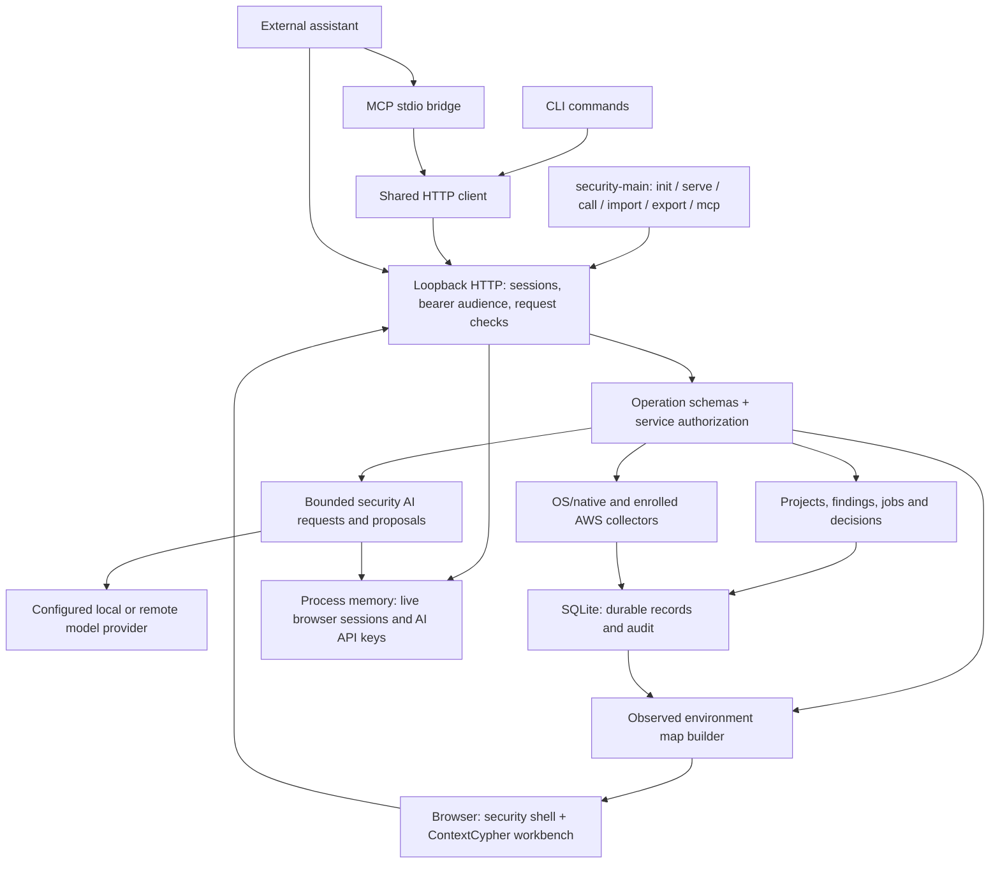

# Guardian Agent architecture overview

**Scope:** Current security application, source inspected 6 September 2026. This documentation update does not establish new product capability or resolve the acceptance gaps below.

Guardian is a locally operated security application with a standalone browser workbench and optional external-assistant control. `src/security-main.ts` starts the security service. The browser serves people directly, including ContextCypher editing, built-in security AI and GRC. Codex and other assistant applications are optional clients.

## Current application boundaries

The diagram shows application ownership, not universal control over the workstation. API keys are used only by the provider boundary; the memory box describes lifetime and is not a separate service. The browser's environment preview is saved through the existing authorized project-import operation. GRC and diagram edits are local drafts until a revision-checked save commits them to the backend.

| Owner | Current responsibility |
|---|---|
| `src/security-main.ts` | Local startup, shutdown and CLI command dispatch. |
| `src/security-workspace/server.ts`, `client.ts`, `mcp.ts` | Loopback HTTP, browser sessions and machine transport translation. |
| `operations.ts`, `service.ts` | Named schemas, role/audience/scope checks, project boundaries, jobs, approvals and operation orchestration. |
| `store.ts`, `contextcypher.ts` | Durable records, storage bounds, audit linkage, graph validation and document envelopes. |
| `ai.ts` with selected `src/llm/` and `src/guardian/` dependencies | Model configuration, discovery, bounded requests, output scanning and proposed documents. `ai.run` does not execute arbitrary tools or commit model changes. |
| `collectors.ts`, `aws-security.ts`, `environment-mapping.ts` | Bounded native/cloud observations and evidence-bearing map previews. |
| `web/security/`, `web/contextcypher/` | Seven-page shell and restored diagram/AI/GRC workflows over backend project revisions. |

## State and authority

SQLite persists project envelopes, findings, jobs, client grants, preferences, collector records and audit events. Live browser sessions are held in an in-memory Map and end when the service restarts. Provider API keys configured in the workbench are also process-local; provider/model preferences may persist. A project mutation and its audit event commit together. Local audit hash linkage is consistency evidence, not an externally trusted archive.

Local browser access is convenient by default: a same-origin browser bootstrap obtains an HttpOnly session. Administrators can require token sign-in; configured Entra SSO enforces sign-in. This convenience mode trusts local processes capable of imitating that bootstrap. Machine interfaces still require scoped credentials. Administrative operations are excluded from assistant MCP and cannot be reached by changing a request body to claim an administrator audience.

Only explicitly registered operations exist in this runtime. A native scan proposal binds its arguments before separate administrative approval. Findings are observations; resolving one records a decision, not proof that the workstation was remediated. AI-generated material and imported documents do not grant execution authority.

## Current scope and acceptance gaps

- Standalone editors restore ContextCypher examples, typed nodes, advanced diagram views and GRC workflows. **Read-only credentials still receive the older reduced Systems renderer**; equivalent read-only diagram fidelity remains unfinished.
- Raw-content imports through the backend preserve exact original bytes. **The workbench's JSON upload currently parses and serializes first**, losing original formatting/BOM fidelity. This documentation revision does not repair that seam.
- Local mapping uses passive neighbor-cache observations. AWS mapping covers collected regional EC2 instances and security-group associations for an explicitly enrolled account. Neither proves physical topology or reachability. Active LAN discovery, wider cloud/identity inventory and automatic refresh reconciliation remain uplift work.
- Entra sign-in is not Azure/Microsoft 365 inventory access. Native Mac and real cloud/tenant acceptance must be recorded separately from mocked tests or CI build success.
- Autonomous security triage, event-triggered response automation and gateway configuration collection are not registered capabilities in the current service. There is no kernel EDR or universally enforced assistant sandbox.

See [the conversion contract](SECURITY-CONVERSION.md), [ContextCypher migration](CONTEXT-MIGRATION.md), [WebUI design](../design/WEBUI-DESIGN.md), [operator guide](../guides/SECURITY-WORKSPACE.md) and [current scope and acceptance gaps](OVERVIEW.md#current-scope-and-acceptance-gaps) for supported workflows and acceptance work.

## Distribution and verification

The distributable contains both the compiled backend dependency closure and the built browser workbench/assets. A dependency listed in `devDependencies` can contribute executable code to the browser bundle. Audit all dependencies as well as the production installation; review every source module included in either closure. Preserve attribution, and keep excluded reference datasets out of distribution.

Required evidence includes type checks, build, operation/security tests, project roundtrips, the isolated production smoke test and actual browser workflows. Windows/macOS/Linux CI validates its executed tests; it does not certify every platform's native integrations or any customer tenant.
