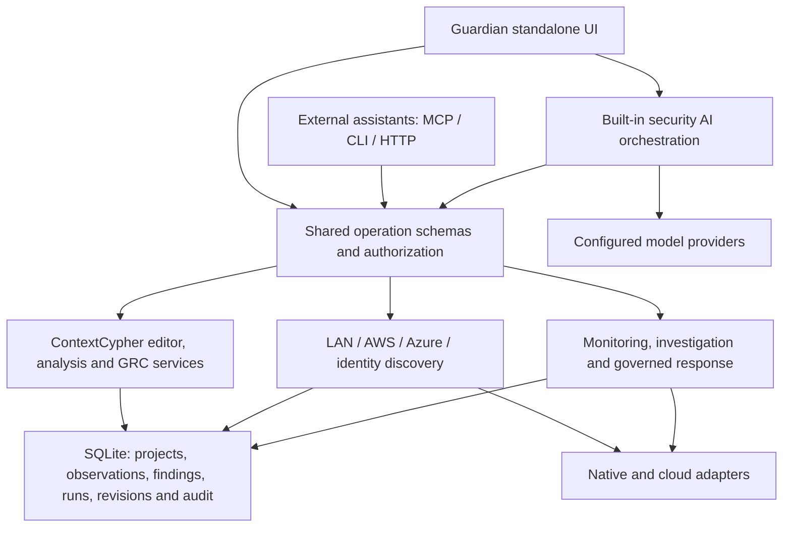

# Guardian Agent: complete security product uplift plan

Date: 6 September 2026. Status: proposed implementation plan, based on source inspection; not a statement of delivered capability.

Inspected working trees: Guardian at base commit `5ac3a501fb878ea154836680fd398c195230e9ec` and ContextCypher at base commit `d3ebdc1b08b9bf83a6ec1a7e973f2c64133500ad`, including local changes. These commit IDs alone do not reproduce the uncommitted work. Two bounded read-only buddy inspections informed this plan; one follow-up review checked its discovery scope and acceptance criteria.

## 1. Product contract

Guardian Agent is a standalone, locally operated security application for protecting a workstation and its local network, understanding connected cloud and identity environments, and helping users avoid unsafe actions. It combines Guardian's defensive services with ContextCypher's architecture, threat modelling, analysis and GRC workflows. External assistants can operate it, but are optional.

The product must support three complete workflows:

1. **Human-operated:** install, open the UI, discover an environment, create/edit models, investigate findings, manage risks, approve responses and produce reports.
2. **Built-in security AI:** configure a local model or supported remote provider inside Guardian; generate and analyse diagrams, investigate alerts, explain risks, propose controls and carry out permitted security workflows. No Codex or other assistant application is required.
3. **Externally operated:** Codex, Claude Code, Grok or another compatible client uses authenticated MCP, CLI or HTTP operations over the same services, with bounded authority.

Without an LLM, discovery, diagrams, deterministic checks, GRC, reports and supported security operations remain usable. Without an external assistant, all product workflows remain usable. Offline operation with a local model remains a first-class option; cloud collection naturally needs connectivity.

The Codex-style appearance is a visual shell and interaction standard, not permission to reduce ContextCypher to generic boxes. The requested simplification concerns unrelated assistant/productivity capabilities and duplicated infrastructure, not the removal of security workflows.

### Conversion and modernization mandate

The user explicitly authorizes improvements and refactoring during conversion, provided ContextCypher's original capabilities remain available. Preserve user outcomes, data semantics and supported workflows; there is no requirement to preserve old implementation details, screen layouts or inefficient interaction sequences.

- Prefer a coherent modern implementation over reproducing historical plumbing. Reuse sound domain logic and tested behaviours; refactor brittle components, duplicated state, provider handling and unnecessary orchestration.
- Improve AI analysis, structured generation, evidence retrieval, tool use and review workflows using capabilities verified on the selected models. Preserve local-model operation and deterministic/manual workflows; stronger models must not become a mandatory substitute for them.
- Improve diagram usability, layout, search, accessibility, performance and discovery reconciliation. Consolidate controls where that makes tasks easier without hiding or dropping functionality.
- Track each modernization against the original capability: original user task, replacement workflow, intended improvement and evidence that it still works. Test advanced settings, imports/exports, saved data and failure/recovery paths as well as the happy path.
- Describe a capability as replaced only when the new workflow achieves the same supported outcome. An AI chat prompt, raw JSON view, external assistant or promised later implementation is not an equivalent replacement for an existing working feature.
- Implement improvements within the agreed security product scope without seeking approval for routine refactoring. Surface a proposed capability removal or material compatibility break before making it.

Feature parity is the minimum acceptance bar, not a ceiling on product quality. Do not expand the project with speculative features unrelated to the agreed scope.

## 2. Evidence and correction to the earlier conversion

The existing 2.0 conversion provides a useful service boundary: loopback HTTP, SQLite persistence, revision-controlled projects, authentication, scoped machine credentials, audit, durable jobs, Windows/native observations, bounded AWS security collection and Entra OIDC code. Its UI does not constitute a complete ContextCypher migration. Historical test counts demonstrate the tested paths, not feature parity.

The original sources remain available. Treat them as reusable implementation and characterization-test sources; do not blindly restore their servers, credential handling or broad execution privileges.

| Area | Evidence in the original/current code | Required disposition |
|---|---|---|
| Examples | ContextCypher `src/data/exampleSystems.ts`: 35 unique examples, 15 categories, 39 category entries | Restore every example and intentional cross-listing, including GRC and attack paths. Extracted JSON is not yet a connected UI feature. |
| Diagram editor | ContextCypher `DiagramEditor.tsx`, `NodeToolbox.tsx`, `SecurityNodes.tsx`, `SecurityZoneNode.tsx`, `NodeEditor.tsx` | Port mature workflows and renderers behind Guardian persistence. Replace the reduced Systems editor rather than add isolated substitutes indefinitely. |
| Advanced diagram work | Original drawing nodes, DFD components, attack-path panels, import/export services, isometric components | Preserve working capabilities; provide advanced controls without crowding the primary workspace. |
| GRC | ContextCypher `components/grc/`, `services/GrcWorkspaceService.ts`, `types/GrcTypes.ts` | Restore usable GRC modules, not just raw JSON or two editable text fields. |
| Built-in AI | ContextCypher `AIRequestService.ts`, `AnalysisService.ts`, `DiagramGenerationService.ts`, `server/aiProviders.js` | Retain workflows and structured outputs; route provider access and mutations through Guardian's backend. |
| Provider support | ContextCypher explicitly declares local/Ollama, OpenAI, Anthropic and Gemini; Guardian retains provider adapters under `src/llm/` | Reconcile and test the union of supported security-relevant integrations; add xAI through its supported API, without inventing model availability. |
| Cloud diagrams | ContextCypher `services/cloud/`, `CloudResourceMapper.ts`, `server/routes/cloudDiscoveryRoutes.js` | Reuse mapping knowledge and UI, repair client/server contracts, authentication, pagination and evidence handling. |
| LAN defence | Guardian `device-inventory`, `network-baseline`, `network-intelligence`, `network-fingerprinting`, `network-traffic`, `network-wifi`, `gateway-monitor` and network tools | Extract useful discovery/detection logic into restricted services. Add discovery-to-model integration. |
| Security reasoning | Guardian `security-triage-agent`, `security-alerts`, `security-alert-lifecycle`, `security-posture`, `containment-service` | Restore security investigation and response workflows through the new operation and approval boundary. |
| Machine access | `src/security-workspace/operations.ts`, `service.ts`, `mcp.ts`, `client.ts`, `server.ts` | Keep one authorization and operation contract; expand it to cover restored workflows. |
| Platform/security adapters | `collectors.ts`, `aws-security.ts`, `entra-oidc.ts`, retained Defender provider | Keep verified behaviour, extend coverage explicitly, perform actual Windows/Mac and tenant/account acceptance. |

Specific cloud discovery issues found in source inspection:

- The original feature is gated by `ENABLE_CLOUD_DISCOVERY`; its existence does not establish successful default operation.
- The AWS frontend sends a query and region; the server expects `resourceTypes` and calls `.map` on it. The server also returns normalized records while the client expects AWS Config fields. Its route omits the supplied session token and does not traverse all result pages.
- The Azure frontend/server record shapes disagree over location/properties, which can lose topology metadata. Pagination is not complete.
- The original UI asks for cloud secrets. That must become backend-owned authentication using explicitly selected authenticated identities.
- Original discovery creates/imports diagrams; it is not a safe, repeatable reconciliation of observed changes with user-authored models.
- No equivalent Entra/Microsoft 365 inventory implementation was established. Current Guardian Entra code signs users into Guardian; it does not enumerate a tenant. Current AWS collection does not create architecture diagrams.

**Cleanup correction:** suspend the earlier blanket advice to delete retained legacy source. First identify reused modules, address their relevant findings, migrate them and prove replacement workflows. Then remove obsolete code and dependencies. The previously isolated security findings become relevant again whenever affected code is reintroduced.

## 3. Target architecture and ownership

Use one application, one local backend and one authoritative store. Keep TypeScript, React, the installed graph library and SQLite. Do not introduce a second database, graph database, microservice fleet, embedded old server or iframe-based second application to avoid doing the integration.

Ownership rules:

- **UI:** interaction, draft editing, presentation and review. No durable competing localStorage workspace and no provider/cloud secrets in diagram files.
- **Shared application services:** validation, project scope, revisions, discovery reconciliation, findings, risk operations, approvals and audit. Extend the existing service boundary; split by real domain when the current monolithic dispatcher no longer remains readable.
- **AI orchestration:** project-scoped context, provider selection, bounded analysis, structured proposals and task progress. It is a client of the same services, not an administrative bypass.
- **Adapters:** narrowly typed access to an OS facility, model provider or cloud/security API. No arbitrary shell/query execution exposed as a convenience interface.
- **Persistence:** transactional state and audit, immutable imported originals, explicit migrations, bounded evidence and backup/recovery. Extend existing tables/records before adding infrastructure.

Natural-language security requests must use the retained Intent Gateway contract. Explicit buttons and named machine operations dispatch directly. Restore shared pending-work/approval continuation where needed; do not create separate retry/resume state in each UI panel or connector.

First write an integration seam around the original editor: load a backend project revision, manage a local unsaved draft, save a validated revision, export original/current formats and report conflicts without losing the draft. Adapt original analysis/cloud/GRC calls to shared operations. Original domain and presentation code can retain its internal structure while these ownership boundaries are corrected.

The operation catalogue must expand beyond whole-document CRUD. Proposed operation families, subject to schema design during implementation:

| Family | Required shared behaviour |
|---|---|
| Connections and providers | List sanitized connection metadata, test/select an identity or model, save/revoke configuration through authorized control-plane actions; callers never receive stored secrets. |
| Discovery | Start an explicitly scoped run, inspect/cancel it, page inventory, preview map changes and apply a revision-checked merge. |
| Analysis and generation | Start/cancel analysis or generation, read evidence-linked results, review and apply a structured proposal. |
| Context and GRC | Existing projects plus typed threat, attack-path, assessment, scoring, treatment and report operations preserving original semantics. |
| Monitoring and response | Configure permitted monitoring schedules, investigate findings, propose supported actions and use the existing approval/job lifecycle. |

Reuse the existing job and audit machinery for these runs. Human-triggered AI receives the intersection of the user's grants, selected project/environment scope and the configured AI action policy; it never inherits unrestricted administrator power because the user is an administrator. Machine operations must cover full workflows, not require an external assistant to reconstruct private JSON schemas or drive hidden UI controls.

## 4. Standalone experience and UI

Use a consistent graphite/light-capable shell, restrained accents, readable typography, collapsible navigation, resizable working areas and accessible keyboard controls. Preserve the density needed for technical diagrams. Source provider icons locally from reviewed bundled assets; never trust imported HTML or arbitrary external styling.

| Navigation | Purpose |
|---|---|
| Protection | Workstation/network status, monitoring controls, protection coverage, new events and recommended actions. |
| Environments | Connections, LAN/cloud/identity discovery, inventory, coverage and drift. “Map environment” opens a reviewable system draft. |
| Systems | Full ContextCypher workbench, examples, diagrams, scope/context, analysis, threat models and attack paths. |
| Findings | Operational findings and investigation, linked to affected resources, systems, controls and risks. |
| Risk & compliance | Original GRC workflows, assessments, treatment, controls, governance, incidents, third parties, initiatives and reports. |
| Activity | Discovery/analysis/response runs, progress, approvals, cancellation, errors and audit. |
| Integrations & settings | AI providers, security adapters, identity, users/client grants, monitoring policies and local data management. |

The Systems workbench must restore:

- Searchable categorized node palette, drag/drop plus keyboard/click insertion, original node types, vendor icons, DFD notation, zones, boundaries and usable resizing.
- Correct connection labels, handles, direction, protocol, encryption, ports, classification and controls; detailed asset properties.
- Undo/redo, cut/copy/paste, multiselect, movement, grouping, zoom, fit, minimap, grid snapping, node search and annotations/drawings. User layout survives save, reload and discovery refresh.
- All 35 built-in examples, categorized browsing and previews. Loading creates a normal independent project; examples are clearly examples and never presented as live observations.
- Scope/custom context, methodology/lens views, deterministic threat checks, AI analysis, threat intelligence, attack paths and GRC links.
- Original supported imports, merge and exports, including diagrams and reports. Inventory the exact original format behaviour rather than promise support from file extensions alone.
- Advanced visualization, including existing isometric functionality, remains available unless a specific feature is later deliberately retired with the user. Its migration must not delay basic editing or force a large renderer into every screen's initial load.

First-run onboarding: launch locally, securely establish local ownership, choose optional built-in AI, select an environment or example, and begin. Human installation should not require CLI token copying. Retain the existing token-file flow for headless/admin recovery and CLI use, but add a one-use local pairing/bootstrap flow that does not expose a reusable token in a URL, logs or browser history. Validate local origin, expiry, replay and the first-owner race. Offer Entra sign-in for configured organizations. Machine credentials remain separate, scoped and revocable.

## 5. Built-in AI: security functionality, not an external dependency

Restore original local/Ollama, OpenAI, Anthropic and Gemini workflows; reconcile Guardian's existing compatible-provider support, including its xAI adapter, into one tested provider layer. Provider discovery, model selection, connection testing and useful authentication errors belong in the UI. Preserve provider-specific capabilities such as supported reasoning controls, tool use, streaming and configured search where used by security workflows; a compatible chat endpoint alone does not prove feature parity. Do not hardcode an unavailable model or assume that a consumer assistant subscription grants API access.

Security AI capabilities required for parity and the merged product:

1. Generate and edit an architecture from a description or imported context, with proposed changes previewed before applying.
2. Analyse a selected diagram, scope or asset; run methodology/rule checks and explain model-generated threats separately from deterministic results.
3. Investigate live findings using linked resource evidence, relevant architecture, threat intelligence and existing controls.
4. Propose attack paths, risk assessments, treatment plans, control improvements and reports using the original GRC workflows.
5. Explain unsafe requested actions, offer an appropriate supported response and continue correctly after human approval.
6. Run explicitly configured monitoring/triage schedules with visible scope, cancellation and cost limits.

Provide an “Ask Guardian” security panel plus contextual actions such as Analyse system, Explain finding and Propose treatment. A global chat interface alone is insufficient; users must be able to complete the structured workflows directly.

Provider calls originate in the backend. Secrets use OS-backed storage where available; supported headless credential references need explicit secure deployment handling. Do not copy ContextCypher's browser-fingerprint-derived credential encryption. Show what selected environment data will leave the machine, allow local-only projects, and prevent fallback from silently switching a local job to a cloud provider.

Send the minimum relevant evidence, respect project/tenant scope, and record model, provider, context revision, evidence references, result status and usage. Budgets bound tokens, time, concurrency and retries; failed generation never becomes a canned successful diagram. Apply results only after schema/graph validation and revision checks. Imported instructions cannot widen scope, choose a secret-bearing provider, approve an action or override policy.

Model capability and product integration are separate. Daybreak Blue/Red or other specialist models can improve results when legitimately available through the user's provider/client, but do not automatically supply telemetry, enforcement or an integration platform. Use capability checks and real client tests; do not invent a special endpoint or claim unavailable access. Default work remains defensive; any active validation must use an explicitly scoped, supported workflow.

## 6. Environment discovery and automatic mapping

This is core requested product scope, not a deferred enhancement. Discovery must produce an editable ContextCypher model and connect observations to security workflows without requiring an LLM to invent the topology.

### 6.1 Shared user journey

**Connect → confirm identity and scope → discover → inspect coverage → preview map/changes → save or merge → analyse → refresh and review drift.**

The UI lists authenticated identities without displaying credentials. The user selects the actual account, tenant, subscription, region or local interface. Existing CLI authentication is reusable; mere login never authorizes scanning every reachable environment. A saved, explicit scope allows later repeat runs without repeated blanket prompts.

Every run reports source, effective identity, scope, start/end time, paging/collection limits, permission gaps, cancellations and stale sources. Empty results, permission denial, truncation and failed discovery must be distinct outcomes. Partial results remain useful but cannot establish complete absence of a resource or control.

### 6.2 Local area network

Reuse Guardian's inventory, neighbor-table collection, network fingerprinting, baseline and traffic metadata logic. Add a dedicated discovery operation and map builder rather than hand arbitrary commands to a model.

Discovery tiers:

| Tier | Collection and map output | Boundary |
|---|---|---|
| Passive/local | Interfaces, addresses/subnets, routes, gateways, ARP/IPv6 neighbors, available DNS names, local listening/established connections | Describes this host's visibility. A neighbor table is not a complete LAN inventory. |
| Bounded active discovery | User-selected interfaces/subnets; rate-limited host probes and optional selected service identification | Explicit scope, finite address/port/time budgets, cancellation and no auto-expansion to VPN/other routes. IPv6 uses known targets/neighbor discovery, not brute-force subnet enumeration. |
| Authenticated infrastructure enrichment | Supported router/firewall/switch/controller APIs; read-only DHCP leases, VLAN and interface/neighbor data when available | Separate connection and permissions. Physical connectivity requires evidence, not a guess from shared IP prefixes. |

Create typed device/service nodes, subnet/VLAN/zone groups and gateway relationships. Mark observed connections, configured connectivity and inferred relationships differently. Do not label inferred device types or MAC/vendor matches as proven identity. Handle address reuse, randomized MACs, duplicate hostnames, sleeping devices and multiple interfaces without merging unrelated devices.

Where an existing external scanner is used, call a constrained supported interface with fixed argument construction and strict output limits. Do not make its installation a requirement for passive mapping, silently install a packet driver, or bundle tools without reviewing redistribution terms. Nmap's documented distinction between host discovery and port scanning supports separate profiles; ARP/ND is local-link evidence, not universal visibility. [Nmap host discovery](https://nmap.org/book/man-host-discovery.html)

Map local connections to cloud resources only when there is a credible identifier or address match within the correct environment and time. NAT, private endpoints and shared public IPs must not create false identity matches. Unmanaged or unobserved assets remain visible as gaps, not “protected”.

### 6.3 AWS

Retain Guardian's account-verified, bounded SDK collection and extend it with ContextCypher's resource mapping. Prefer selected short-lived profile/Identity Center or workload-role credentials. Verify effective STS account/role on each run. Never silently fall back to an ambient profile in a different account. Existing CLI login is a supported entry point; the standalone UI also needs guided connection and reauthentication. The SDK supports multiple credential sources, whose precedence must be controlled deliberately. [AWS SDK credential providers](https://docs.aws.amazon.com/sdk-for-javascript/v3/developer-guide/setting-credentials-node.html)

Implement these coverage increments under the same connection and map contract:

- Network topology: VPCs, subnets, route tables, gateways, security groups, network ACLs, interfaces, endpoints, peering/transit connectivity and load balancers where permitted.
- Workloads and data: EC2, RDS, S3, Lambda, ECS/EKS inventory and DynamoDB, followed by the original discovery resource set. Reuse the broader original vendor mapping definitions, but publish an explicit resource/API/permission coverage matrix: an icon or mapping label does not prove discoverability. Distinguish service inventory from deeper workload internals that were not collected.
- Security/identity context: Security Hub and GuardDuty observations; scoped IAM roles/policy metadata and resource associations where required to explain access. No secret-value retrieval or storage-object content reading as an inventory shortcut.
- Multi-region and explicitly enrolled multi-account selection. Begin with the existing account boundary, then add account lists/assumed roles without conflating environments. AWS Organizations discovery is an optional privileged enrollment feature, not automatic account expansion.

Use direct read APIs for required baseline coverage. Use AWS Config and configured aggregators when already available; do not require or silently enable a billable recorder to obtain a basic map. Config query coverage depends on supported and recorded resources. [AWS Config queries and limitations](https://docs.aws.amazon.com/config/latest/developerguide/querying-AWS-resources.html)

Traverse pages, bound retries, display per-service coverage, and preserve partial progress. Expose the required read-only policy before connection. Show API/cost considerations for optional telemetry sources; do not turn on flow logs, paid services or new resources during discovery.

### 6.4 Microsoft: three separate connections

| Connection | Purpose | Authentication/authority |
|---|---|---|
| Entra sign-in to Guardian | Identify the person and assign Guardian roles | Existing OIDC login path and configured group/role mapping. |
| Azure infrastructure discovery | Map cloud resources and network configuration | Explicit Azure tenant/subscription selection with read access; supported CLI, interactive or workload identity flow. |
| Entra / Microsoft 365 security discovery | Map directory/application/device relationships and licensed security inventory | Separate Microsoft Graph permissions and consent, with independently tested collection scopes. |

Azure mapping reuses the original Resource Graph client/mapping knowledge but moves queries into the backend and repairs response contracts. Cover resource groups, VNets/subnets, NICs, NSGs, routes, public IPs, gateways/peering, VMs, load balancers/application gateways, storage, databases, app services, AKS inventory and private endpoints. Use resource IDs for relationships; traverse all pages and use additional ARM reads only for defined gaps. Resource Graph requires resource read authority and only returns the caller's accessible resources. [Azure Resource Graph overview](https://learn.microsoft.com/en-us/azure/governance/resource-graph/overview)

The initial Microsoft identity deliverable covers applications/service principals, managed identities, groups, selected role/consent relationships and registered devices, with user detail minimized to what the selected security use requires. For Microsoft 365, include organization/subscribed-product metadata and group-to-application/service relationships when exposed by the selected supported API and consent; this is an identity/security-context view, not a complete map of every SaaS workload. Mailbox, Teams channel and SharePoint site inventories are additional explicitly scoped workload connectors, not silently implied by “Microsoft account mapping”. Optional Intune/Microsoft Defender connectors add managed-device posture, security findings and separately controlled response capabilities. No mail, document or message contents are imported by default.

Graph delegated and application permissions have different authority and consent requirements. A personal Microsoft login does not establish an enterprise tenant or sufficient Graph/Intune permissions; a CLI Azure token is not automatically the right token for every API audience. Show connected, consent-required, not-licensed, denied and unsupported states explicitly. Define endpoint-by-endpoint minimum permissions during implementation and verify them in a real tenant. [Graph permission model](https://learn.microsoft.com/en-us/graph/permissions-overview), [Entra APIs](https://learn.microsoft.com/en-us/graph/identity-network-access-overview), [Intune inventory APIs](https://learn.microsoft.com/en-us/graph/intune-concept-overview)

GCP discovery already exists in ContextCypher. Preserve and repair it after the explicitly requested LAN/AWS/Microsoft paths within the parity work; do not silently remove it. There is no evidence here of live IBM discovery merely because IBM example diagrams exist.

### 6.5 Reconciliation, evidence and model integrity

Use a small normalized resource/relationship representation stored in SQLite alongside projects. Keep existing ContextCypher documents as the editable model format; link them to inventory rather than force all models into a new schema. Avoid a second graph engine.

- Stable source identity includes connector instance and provider account/tenant, region/subscription where applicable, and native resource ID. LAN identity uses available durable identifiers plus explicit uncertainty; IP address alone is not a universal key.
- Observations carry timestamps, collector/run identity, source references and coverage. Relations distinguish configured topology, observed traffic, analyst assertions and AI hypotheses. Access-policy association is not proof of successful network reachability.
- A discovery import is deterministic without AI. It creates a draft with vendor types and useful grouping/layout. AI can suggest names, explanations and risk interpretations separately.
- Refresh computes additions, changes and missing observations against the last comparable completed scope. Partial or failed runs cannot delete assets. Mark stale/missing evidence for review.
- User-authored labels, coordinates, descriptions, threats, controls and GRC references survive refresh. Explicit field ownership and conflict review prevent overwrites. Keep source facts separate from analyst interpretation.
- Stable diagram IDs preserve references. Cross-project links require authorization on every project; a global inventory lookup must not leak other projects' existence.
- Draft merge is atomic and revision-checked. Preserve imported originals, handle undo of accepted map changes, and retain a reviewable change summary.
- Large environments use filtered/subsystem views, bounded pages and background layout. A 5,000-resource inventory should not force 5,000 fully rendered nodes onto one canvas. Tune import/storage limits against real saved documents, including the approximately 17 MB Downloads model currently above the 16 MiB limit; do not simply remove limits or silently drop data.

## 7. Protecting the user and workstation

Restore the defensive product, not only posture checks. Port useful monitoring, alert lifecycle, network baseline, flow heuristics, security triage, gateway integration and response scheduling into the new boundary. Each capability must show its observation source, coverage and actual enforcement scope.

Required workflows include identifying newly seen devices/services, reviewing persistence and process/network anomalies, correlating native alerts with assets, explaining suspected automated activity, inspecting proposed changes, approving supported responses and checking their outcomes. Baselines begin as unreviewed observations; first discovery must not classify an existing compromise as trusted.

“Protect users from themselves” means clear consequence previews, scoped authority, preservation of drafts/data, meaningful confirmation for consequential actions, recovery steps and prevention of unreviewed AI execution. Do not frustrate ordinary editing and already-authorized read-only work with repetitive approvals.

Keep collection permissions separate from changes to firewall rules, isolation, quarantine, deletion, identity policy or cloud infrastructure. A human click is still subject to backend role and policy checks. High-impact actions bind exact targets/parameters and expiry; approval cannot transfer to a changed plan. A provider's accepted request is not a verified completed remediation.

Guardian can govern its own actions and enrolled integrations. Stronger control over unrelated bots/processes requires actual OS/EDR/gateway enforcement. Model intelligence, MCP registration or a user-space monitor does not intercept arbitrary external activity. Document unsupported prevention explicitly while extending supported actions through native and vendor adapters.

## 8. Security software and enterprise integration

Use the existing normalized findings/job boundary as the starting adapter contract. An adapter declares separately: inventory, health, findings, response actions, platform support, permissions, licensing and verification status. Avoid a generic “integrated” badge that conflates those capabilities.

- **Windows Defender Antivirus:** retain local posture/alerts and approved scan requests; restore relevant original scan/report workflows where safely supported.
- **macOS:** verify native posture and monitoring on a real Mac; use supported vendor APIs for deeper endpoint response. Do not invent a generic XProtect scan API.
- **Defender for Endpoint / Intune:** add genuine enterprise device/finding interfaces, with response permissions distinct from read inventory. Defender's isolate API is a specific authorized product action, not something provided by local Defender inventory. [Defender isolate-machine API](https://learn.microsoft.com/en-us/defender-endpoint/api/isolate-machine)
- **Other antivirus/EDR:** retain installed-product detection; implement vendor adapters for the selected products, beginning with actual user/customer environments. CrowdStrike, SentinelOne, Sophos and Malwarebytes are candidate integrations, not claims of implemented support. Confirm each documented API and license before committing to its response actions.
- **SIEM/SOAR and proprietary tools:** documented authenticated event ingestion/export, stable IDs, deduplication, delivery status/retry and bounded queues. Add concrete vendor protocols where demanded, not an unrestricted plugin code-execution system.

Enterprise foundation includes user/project/environment roles, Entra SSO, separate human/service identities, revocation, credential storage, tenant separation, audit export, retention, backup/restore and managed configuration. Existing global grants/SQLite records need tests for the richer environment scopes before adding multiple teams.

Keep the default desktop/local installation. Privately hosted infrastructure is a supported target architecture; any later multi-user private controller needs deliberately designed TLS, server identity, browser authentication/callbacks and remote endpoint enrollment. Loopback plus an arbitrary reverse proxy is not that design. Fleet controller/agent deployment, signed updates, service hardening and enterprise operational acceptance are explicit later milestones; no public SaaS is required.

## 9. Security review conditions for reused code

The previous Daybreak report describes a reviewed, much smaller runtime closure. Its findings isolated by excluding old code cannot be carried forward as fixed when that code is restored. Maintain a finding-to-module disposition and re-evaluate every imported path.

Priority boundaries:

- Authentication/session expiry, project/environment scope, cross-client and cross-tenant access, first-run ownership and recovery.
- Provider and cloud credential handling, allowed endpoints, redirects/SSRF, token audience and explicit identity selection.
- Untrusted diagrams, labels, SVG/HTML/report generation, URLs, drawing data, file paths and export filenames.
- Model input/output boundaries and streaming. The retained `GuardedLLMProvider.stream` emits chunks before its final secret scan; do not reuse that as a claim of leak prevention. Sensitive output must be checked before release; post-hoc logging cannot retract disclosed text. Prompt minimization before remote transmission remains necessary.
- Native probes and vendor commands, fixed arguments, privilege boundaries, cancellation and bounded parsing; no revived arbitrary shell bridge.
- Approval continuation, changed targets, replay, interrupted jobs and actual response verification.
- Database/graph limits, import expansion, snapshot retention, disk exhaustion, expensive layouts and large inventory pages.

Use focused security tests and one bounded independent review for each meaningful boundary change. Run Daybreak Blue on a defined immutable integrated revision before release, with clear coverage, progress and stopping conditions. No unattended repeated deep scans or open-ended review loops. Repair concrete findings and rerun relevant checks; reserve broad reruns for changed integration risk.

## 10. Implementation sequence and deliverables

Sequence by dependency and demonstrable workflows, not elapsed engineer-week estimates. AI assistance changes implementation throughput, not the definition of completion. No phase is complete because code compiles or a model says it is.

| Stage | Work and concrete output | Exit gate |
|---|---|---|
| 0. Baseline and recovery | Preserve current uncommitted work and original repositories/data; inventory source dependency closure and workflows; record current screenshots; mark partial example/palette work accurately; reconcile known findings. | Feature ledger identifies source, target owner, status and acceptance case for every original security workflow; no destructive cleanup. |
| 1. Full editor integration | Port original ContextCypher workbench under Guardian shell and project persistence; examples, palette, rendering, graph editing, history, rich properties, scope, imports and exports. | All examples open; real saved documents retain appearance/semantics; edit/save/reload/export/reimport works; keyboard/drag/drop and draft conflicts pass in Vivaldi. |
| 2. Standalone AI and GRC | Backend provider configuration and security orchestration; generation, analysis, threat intel, attack paths, full GRC and reporting; shared operation coverage. | A user with no external assistant completes describe/generate/analyse/review/risk/treatment/report using a real configured provider; equivalent local-model lane tested. |
| 3. Discovery and map refresh | Shared connection/run/inventory/reconciliation path; LAN, authenticated AWS, Azure, Entra/M365 scopes; repair/preserve GCP. | Real selected environments create accurate reviewable diagrams; second discovery preserves edits and reports drift; wrong identity, expiry, paging, partial failure and cancellation tests pass. |
| 4. Defensive operations | Restore monitoring/baselines, security triage, evidence links, native/vendor workflows and scoped schedules. | An observed test event reaches a mapped asset, investigation and approved supported response with verifiable outcome; monitoring continues without a model. |
| 5. External and enterprise access | Feature-complete operation exposure; actual assistant client checks; Entra tenant acceptance; connector scope and audit delivery; private deployment design. | Human and machine paths share policy; unauthorized clients cannot approve, change credentials or cross scope; real tenant/account and selected connector tests documented. |
| 6. Release integration and cleanup | Full regression, focused Daybreak/buddy review, Windows/Mac packaging, install/update/recovery, dependency/license review and corrected documentation; remove replaced legacy code only now. | Product acceptance matrix passes on both platforms, no unresolved release-blocking findings, actual runtime dependency closure inspected and user walkthrough completed before GitHub push. |

Bound independent work by ownership: editor migration, provider/orchestration, discovery adapters and validation can progress in parallel after contracts stabilize. One integrator owns shared schemas/persistence and branch state. Use short, reviewable tasks with concrete outputs; stop and report a repeated failure rather than consume tokens on redundant retries.

## 11. Acceptance matrix: proof of the requested product

| ID | Scenario | Required evidence |
|---|---|---|
| A01 | Fresh Windows and Mac installation | Launch, ownership, local UI, safe shutdown/restart, retained state; no external assistant or mandatory AI account. |
| A02 | Original example library | All 35 unique examples, 15 categories and intended cross-listing; nodes/edges/GRC/attack-path fields preserved. |
| A03 | Full editor interaction | Palette search, drag/drop and keyboard insertion; vendor/DFD/zone rendering; edge handles/labels; resize, multiselect, copy/paste, undo/redo and annotations. |
| A04 | Real document fidelity | Representative Downloads files plus large/complex original models; layout, parent geometry, threats, controls and references survive roundtrip without silent normalization. |
| A05 | Original GRC workflow | Assessment through scoring, risk acceptance/treatment, controls/compliance, task/initiative linkage and reporting, including saved history. |
| A06 | Standalone AI | Real provider connection, generation, analysis and reviewed changes entirely in Guardian; local-only lane and no unexpected provider fallback. |
| A07 | Deterministic/offline operation | Models, rule checks, existing evidence, reports and local monitoring work with providers disabled. |
| A08 | LAN mapping | Known authorized hosts/gateway/subnet appear; passive coverage clearly bounded; active scope excludes VPN/unselected ranges; IPv6/multihoming handled. |
| A09 | AWS mapping | Confirmed selected account/region resources map with evidence; stale CLI auth/wrong account denied; pagination and denied services visible; no write APIs invoked. |
| A10 | Azure mapping | Correct tenant/subscriptions; VNets/resources/relationships and coverage; no dependence on pasted browser secrets. |
| A11 | Entra/M365 mapping | Consent-scoped identity/device map, proper API audience, consent/license failures explained, Guardian SSO privileges not treated as Graph access. |
| A12 | Discovery refresh | Stable IDs; repeated run no duplicates; user layout/context survives; partial discovery cannot remove resources; approved drift saved atomically. |
| A13 | AI proposal integrity | Invalid graph, invented evidence, stale revision, untrusted instructions and unauthorized action proposals rejected without losing drafts. |
| A14 | Bot/self-protection workflow | Safe synthetic local events demonstrate detection source, explanation and governed response; enforcement claims match actual provider/OS action. |
| A15 | External assistant parity | Real MCP/CLI/HTTP clients can discover, model, analyse and propose permitted work; machine credentials cannot self-approve or change admin policy. |
| A16 | Enterprise identity and scope | Real Entra sign-in, role denial/revocation/expiry; project and environment boundaries tested across users and connectors. |
| A17 | Adverse conditions | Provider outages, rate limits, expired cloud auth, offline network, restart mid-job, full disk, large maps and cancellation produce honest recoverable states. |
| A18 | Security-software integration | Inventory, findings, action request and completion each tested only where supported; installed AV registration alone never passes health/response acceptance. |
| A19 | Security regression | Reused-module finding ledger, negative authorization/import/SSRF/command/streaming tests and bounded independent review of the delivered revision. |
| A20 | User experience and release | Vivaldi walkthrough on Windows plus Mac browser/native checks; readable dense diagrams, keyboard access and responsive non-canvas flows; signed packaging/update gates reported accurately. |
| A21 | Restored GCP discovery | Repaired client/backend mapping, selected project identity, complete/bounded pagination, resource relationships and diagram roundtrip; real-credential acceptance or an explicit unverified gate if no GCP environment is available. |

Real account/tenant/native checks are required to mark those integrations operationally verified. If an environment is unavailable, record the exact blocked acceptance case rather than infer success from mocks. Use safe synthetic fixtures for destructive-response tests; existing permission to inspect an AWS account is not authorization to modify it or trigger paid services.

Performance acceptance must use real representative examples and large inventories: record first load, fit/layout, edit latency, memory and cancel responsiveness on the test machines. Establish measured thresholds before tuning. Preserve storage limits and make enterprise retention configurable with tests rather than discard data to fit arbitrary defaults.

## 12. Retain, improve and retire

**Retain and restore:** full ContextCypher security workflows, provider choice/local AI, examples, diagram formats, GRC, discovery/mapping, Guardian's useful defensive monitoring/triage, and CLI/MCP/HTTP automation.

**Improve:** standalone onboarding, unified state and authorization, safe cloud authentication, repeated discovery reconciliation, source/evidence links, actual vendor capabilities, cross-platform verification, cost controls, accessibility and honest coverage reporting.

**Retire after replacements pass:** unrelated coding IDE/general productivity workflows, duplicate authentication/storage/provider plumbing, obsolete hosted-public deployment paths, unsafe credential UI and unsupported broad execution bridges. Preserve security notifications/workflows even when retiring unrelated communications integrations. Keep existing visual/advanced security features unless explicitly evaluated and intentionally retired; aesthetic simplification alone is not a reason to delete them.

Update `SECURITY-CONVERSION.md`, `CONTEXT-MIGRATION.md`, `WEBUI-DESIGN.md`, the capability guide, operator/reference guides, AGENTS instructions, startup scripts and relevant tests together as each new boundary lands. Mark old “as-built” claims as historical when they no longer describe the current runtime. Do not advertise the merged product as complete until this acceptance ledger and the actual user walkthrough support it.

## 13. Source references and status

### Inspection build: first discovery-to-model path

The Environments page now previews the latest recorded passive OS neighbor cache or explicitly enrolled AWS EC2/security-group inventory and creates a new editable system. The shared `environments.preview` operation is read-only, installation-scoped and additionally requires cloud-read permission for AWS. It does not start collection implicitly. Assets carry stable, scope-qualified IDs and observed source identifiers/timestamps; graph edges are recorded cache or security-group associations, not inferred cables or reachability. The existing authorized collection jobs and project-import operation own collection and saving.

This is a bounded first step toward A8/A9, not completion of either acceptance scenario. Active LAN discovery, physical topology, full AWS service inventory, Azure/Entra/M365/GCP adapters and revision-checked discovery reconciliation remain outstanding. Creating a fresh snapshot preserves existing user models; it does not claim to merge drift. Functional tests cover three OS cache formats, invalid/incomplete data, bounded output, AWS identity/scope checks, project-restricted denial and valid ContextCypher imports. Actual browser/local inventory and cloud-account acceptance remain separate gates.

Local evidence: [current conversion architecture](../architecture/SECURITY-CONVERSION.md), [migration domain contract](../architecture/CONTEXT-MIGRATION.md), [previous Daybreak dispositions](../research/DAYBREAK-BLUE-SECURITY-REVIEW-2026-09-06.md), [original defensive-suite design](../design/AGENTIC-DEFENSIVE-SECURITY-SUITE-AS-BUILT.md), [current operator guide](../../../../guides/SECURITY-WORKSPACE.md), Guardian source under `src/security-workspace/`, `src/runtime/` and `src/llm/`, and authoritative ContextCypher source under `S:/Development/contextcypher`.

Cloud/API references linked above were checked against official documentation while preparing this plan. Source-code review establishes what code exists, not that every original integration worked. No cloud account calls, active network probes, runtime restarts or application changes were performed to prepare this plan. It deliberately replaces the earlier reduced-product migration target; implementation remains to be completed and verified.
