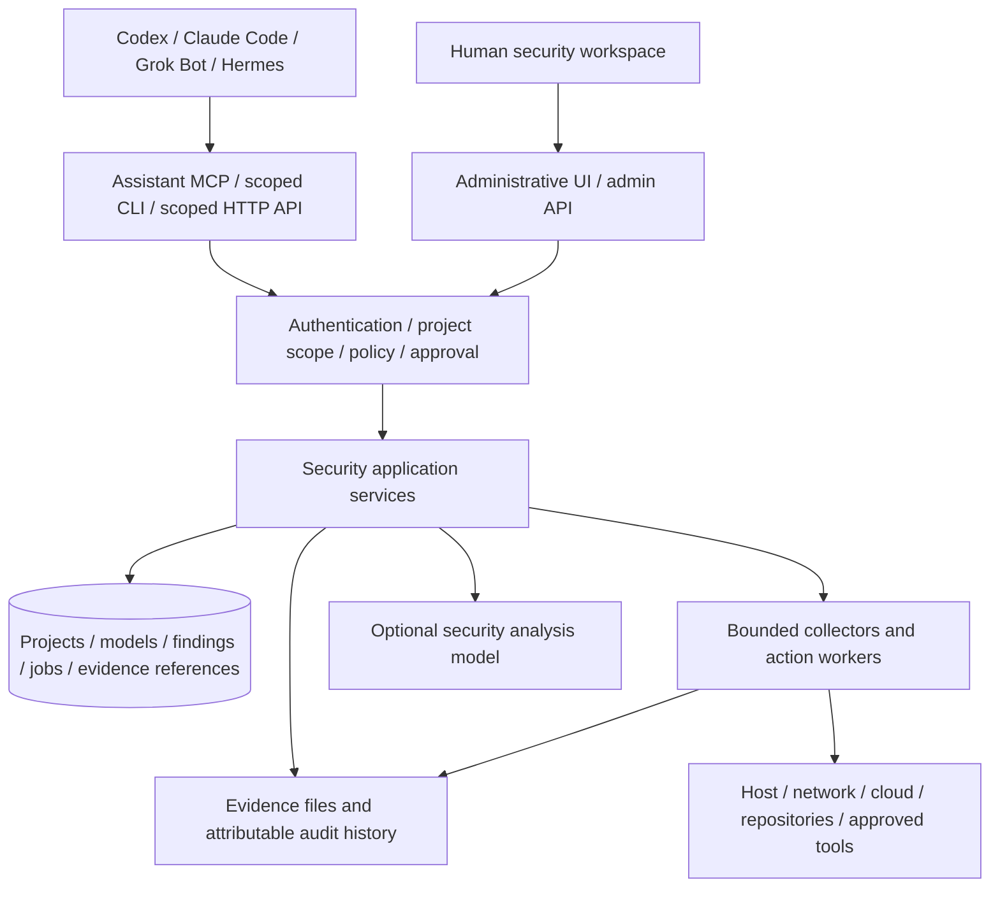

# Guardian Agent: security product redesign and ContextCypher integration

> Revised product direction: the [comprehensive uplift plan](../plans/GUARDIAN-SECURITY-UPLIFT-PLAN-2026-09-06.md) supersedes reductions that removed standalone security AI or mature ContextCypher workflows. External assistants are optional, and LAN/AWS/Microsoft discovery must produce usable, refreshable architecture maps. The report below remains historical research, not a complete implementation claim.

**Decision report · 6 September 2026**  
**Status:** Recommendations, not an implemented migration.  
**Authoritative repositories:** `S:\Development\GuardianAgent` and `S:\Development\contextcypher`.  
**Design direction:** A Codex-inspired security workspace, fully operable through supported machine interfaces.

**Second-pass review:** Re-reviewed with Daybreak Blue on 6 September 2026. Corrections from that review are incorporated below, including current protection limits, broker authorization gaps, Daybreak integration scope, control-plane separation, an explicit threat model, and more conservative delivery ranges.

**Reading guide:** Start with the recommendation and the feature decisions in sections 4–5. The core protection mission is in section 9, enterprise integration in section 10, the UI in section 11, and delivery/verification in sections 12–14. Sections 6–8 contain the technical architecture and machine-interface contracts.

### Second-pass verdict

The product direction is approved with corrections. Guardian has valuable security controls and ContextCypher has valuable architecture/risk context, but the current application is not yet a general preventative endpoint product. Before external-assistant exposure, repair broker/web identity authority, separate assistant and administrative capability surfaces, establish the protected local-service/update boundary, and validate the complete migration format. Daybreak Blue is a strong optional analysis capability; it does not replace sensors, policy, isolation, approvals, or verification. Delivery is governed by implementation and acceptance evidence; original engineer-week estimates below are historical and superseded by SECURITY-CONVERSION-REVIEW-HANDOFF-2026-09-06.md.

## 1. Recommendation

Repurpose Guardian Agent into an **AI-aware security control and coordination layer for the workstation and local network**, with a local-first security workbench and controlled execution service. Its primary job is to reduce harm from malicious automated activity, unsafe actions by otherwise legitimate assistants, and consequential user mistakes. Bring ContextCypher's system modeling, threat modeling, and essential risk treatment capabilities into that product as supporting security context. Let Codex, Claude Code, Grok Bot, Hermes, and other assistants supply general reasoning, conversation, and coding.

The combined product should own five things:

1. **Security context:** systems, assets, data flows, trust boundaries, controls, and business impact.
2. **Security evidence:** observations, alerts, findings, assessments, and investigation history.
3. **Security decisions:** policies, treatment plans, risk acceptance, and approvals.
4. **Bounded security operations:** collection, scans, approved response actions, and separate verification checks.
5. **Interoperability:** the same operations through an authenticated API, MCP, a noninteractive CLI, and a human UI.

Recommended positioning:

> **Guardian Agent protects your workstation and local network, helps prevent unsafe actions, and connects security evidence to the systems you care about. Operate it yourself or through your preferred AI assistant.**

The most valuable combination is the connection between an architectural weakness and an observed security event. A diagram explains what could go wrong; monitoring supplies observations; an investigation connects the two; a reviewed action changes something; verification establishes whether the intended improvement actually happened.

Do not merge both applications wholesale. Retain Guardian's security foundations, extract ContextCypher's useful domain logic and editor, and retire the general assistant product. Use one backend, one identity and authorization system, one authoritative security workspace, and one UI shell.

This is a substantial product migration. It is much more than removing the chat page, but it does not require rewriting every detector, diagram component, or risk calculation.

**Current-state conclusion:** Guardian is not yet a general preventative endpoint or network-security product. Its strongest prevention applies to actions routed through Guardian; its host monitoring is periodic baseline comparison, and its network view is connection metadata unless a gateway or external sensor supplies more. The redesign must preserve that honesty. The product can become a useful protection layer by governing assistant operations, coordinating native security controls, and integrating existing AV/EDR/network products. It should not claim EDR, NDR, ransomware prevention, or universal assistant containment without the corresponding enforcement and telemetry.

## 2. What this review establishes

### Repository baseline

| Repository | Revision reviewed | Initial working-tree state | Role in this report |
|---|---|---|---|
| GuardianAgent | `5ac3a501` | Clean | Security runtime and host application |
| contextcypher | `d3ebdc1` | Existing modification to `server/config/provider-settings.json` | Authoritative threat-modeling application, confirmed by you |

The commercial stream is excluded from the integration scope: you confirmed it contains no separate feature work that needs to be merged. The backup directory `contextcypher - Copy` was located but not used as a source. Local secrets and provider-setting values were not needed for this review. Existing changes were preserved. No application implementation, branch, deployment, or running backend was changed. The ContextCypher test reporter rewrote its tracked JUnit output; that generated change was restored after inspection.

This is a product and architecture review based on repository inventories, owning design documents, representative implementation paths, selected tests, and current official interoperability documentation. It is **not** a line-by-line audit of every file, a penetration test, or proof of production readiness. Where documentation and code differ, the recommendations rely on the code inspected. Features described as proposed below do not exist merely because their names appear in this report.

### Size and concentration

The inventory counted tracked `.ts`, `.tsx`, `.js`, `.jsx`, and `.rs` files under application source roots, excluding paths containing `vendor` and `.min.`. Counts are physical lines, including blanks and comments; test files were classified by `.test.`, `.spec.`, or `__tests__` in the path.

| Measure | GuardianAgent | ContextCypher |
|---|---:|---:|
| Tracked files, all types | 1,373 | 1,236 |
| Selected source files, including tests | 858 | 385 |
| Selected non-test source files | 522 | 366 |
| Non-test physical lines | 277,000 | 200,109 |
| Selected test files | 336 | 19 |
| Test physical lines | 151,053 | 3,472 |

ContextCypher includes 56,215 lines in `src/data/`, including extensive examples. These totals therefore measure maintenance surface, not equivalent executable complexity or test coverage. Do not turn them into a promised percentage reduction.

Important concentrations:

| File | Physical lines | Why it matters |
|---|---:|---|
| Guardian `src/index.ts` | 7,106 | Startup still composes a very broad product |
| Guardian `src/tools/executor.ts` | 8,075 | Shared enforcement and unrelated tool families are coupled |
| Guardian `src/chat-agent.ts` | 4,442 | Conversation owns substantial orchestration |
| Guardian `src/supervisor/worker-manager.ts` | 5,445 | General delegated execution carries significant maintenance cost |
| Guardian `web/public/js/pages/code.js` | 8,332 | A sizable competing coding workbench |
| Guardian `web/public/js/pages/config.js` | 7,940 | Configuration reflects the breadth of the assistant platform |
| ContextCypher `src/components/DiagramEditor.tsx` | 7,370 | Editor, persistence, analysis, and UI workflows are interwoven |
| ContextCypher `src/services/GrcWorkspaceService.ts` | 5,461 | Valuable domain calculations alongside a broad GRC product |
| ContextCypher `server/index.js` | 5,375 | Routes, prompts, providers, and initialization share one large entrypoint |

Guardian's forward architecture already identifies the composition root and executor as extraction targets. This pivot is an opportunity to remove product responsibilities from them, rather than merely distributing the same responsibilities across more files. [Guardian forward architecture](S:/Development/GuardianAgent/docs/architecture/FORWARD-ARCHITECTURE.md)

## 3. Product focus and competitive position

Your decision to stop building a general assistant is sensible. Guardian currently spends effort on personal information management, code execution, conversation routing, browser automation, productivity connectors, scheduling, and presentation modes. Those are expensive areas to maintain while also building a credible security product.

However, **“security agent” by itself is not an uncontested position**. OpenAI already documents Codex Security for discovering, confirming, and fixing code vulnerabilities, with plugin, CLI, SDK, and cloud surfaces. Building another generic AI repository scanner would reintroduce much of the competition you want to avoid. [Official Codex Security overview](https://learn.chatgpt.com/docs/security)

Recommended initial audience: users running powerful AI assistants on their workstations, security-conscious home/small-office operators, and the practitioners responsible for protecting those environments. The enterprise destination is a security tool that integrates with existing endpoint/network defenses, SIEMs, identity providers, and approval processes. Build organization, device, actor, and project scopes into the contracts now; introduce centrally managed fleets and SSO through explicit release gates. Several project records alone do not constitute enterprise multitenancy.

The specific value proposition should be:

| Customer question | Guardian's responsibility |
|---|---|
| What am I protecting? | Systems, assets, data classification, ownership, and boundaries |
| What could go wrong here? | Reviewed threats and attack paths tied to the actual model |
| What has changed or been observed? | Timestamped host, network, cloud, and assistant-security evidence |
| Why does this finding matter? | Affected assets, business importance, control gaps, and corroboration |
| What can an assistant do about it? | Discoverable, scoped operations governed by explicit policy |
| What was approved and what happened? | Durable action records and attributable evidence |
| Was it fixed? | Verification against a stated condition, with residual risk preserved |

A suitable first release serves those questions across one installation and its configured systems. Fleet management, a full SIEM, a kernel EDR, enterprise GRC, and an open-ended automation platform should not be first-release claims.

## 4. GuardianAgent assessment

### Strong foundations to retain

**Security enforcement.** Admission controls, capabilities, path restrictions, shell validation, SSRF protection, output redaction, control-plane integrity, policy, brokered execution, and sandbox availability are useful independent of the chat assistant. Preserve the controls while changing their callers. [Guardian security implementation](S:/Development/GuardianAgent/src/guardian/guardian.ts), [policy engine](S:/Development/GuardianAgent/src/policy/engine.ts), [sandbox contract](S:/Development/GuardianAgent/src/sandbox/types.ts)

**Local defense.** Host monitoring, network baselines, gateway posture, Windows Defender integration, unified alerts, and security activity history already provide an outward-facing security foundation. The as-built document explicitly separates these from runtime self-protection. [Defensive security suite](S:/Development/GuardianAgent/docs/design/AGENTIC-DEFENSIVE-SECURITY-SUITE-AS-BUILT.md)

**Lifecycle and audit concepts.** Existing execution records, pending actions, policy decisions, and audit records can support external clients. Preserve their invariants, but remove unnecessary dependence on chat sessions and channel-specific continuation. [Pending actions](S:/Development/GuardianAgent/src/runtime/pending-actions.ts), [tool approvals](S:/Development/GuardianAgent/src/tools/approvals.ts), [audit persistence](S:/Development/GuardianAgent/src/guardian/audit-persistence.ts)

**Security-specific AI work.** The security triage service already emphasizes read-only evidence gathering and distinguishes routine guardrail noise from more useful investigation candidates. Reuse that narrower behavior. [Security triage](S:/Development/GuardianAgent/src/runtime/security-triage-agent.ts)

### Boundaries that must be visible in the new product

**Current containment primarily constrains Guardian-managed operations.** The containment service restricts categories such as browser mutation, scheduled mutation, commands, network actions, and MCP calls within Guardian's execution path. It is not proof that Windows has isolated the host or that a separately running assistant has lost network access. Rename status descriptions to identify the actual enforcement surface. [Containment actions](S:/Development/GuardianAgent/src/runtime/containment-service.ts:13)

**Current host monitoring is polling and heuristic.** `HostMonitoringService.runCheck()` gathers task/process lists, persistence entries, selected path fingerprints, connection/listener snapshots, and firewall state. Suspicious processes are identified by configured executable names rather than behavior, lineage, signer, reputation, or event telemetry. The first accepted baseline can also contain an already-compromised state. Treat these results as posture/drift observations, add baseline review, and integrate higher-fidelity native or vendor telemetry before making real-time detection claims. [Host check](S:/Development/GuardianAgent/src/runtime/host-monitor.ts:286), [process-name rule](S:/Development/GuardianAgent/src/runtime/host-monitor.ts:763)

**Network detection uses connection metadata.** The network traffic service explicitly avoids packet payload capture and applies flow-metadata heuristics. Findings named “data exfiltration” or “lateral movement” should be presented with their actual evidence and limitations. Missing byte counters must be treated as unavailable telemetry, not evidence of zero transfer. [Network traffic service](S:/Development/GuardianAgent/src/runtime/network-traffic.ts:1)

**Assistant Security currently focuses on Guardian.** Its targets are runtime and workspace snapshots, including Guardian's configured MCP servers, sandbox, browser, and policy settings. This is a useful base for a future cross-assistant posture assessment, but it is not currently an inventory or protection layer for every installed Codex, Claude, Grok Bot, or Hermes environment. [AI security contract](S:/Development/GuardianAgent/src/runtime/ai-security.ts:15)

**Managed package review is bounded.** The documented install review stages top-level requested package artifacts; it does not claim full dependency-closure inspection or interception of unmanaged installs. Keep it as a governed supply-chain review capability and improve reproducibility before expanding its claims. [Managed package trust boundary](S:/Development/GuardianAgent/SECURITY.md)

**A hash chain is not an independently trusted archive.** The audit implementation uses SHA-256 linkage. That helps identify inconsistent edits relative to a trusted history, but someone who controls the entire local log can rewrite a chain. External checkpoints or a separately controlled append-only destination are needed for stronger tamper evidence. [Audit persistence](S:/Development/GuardianAgent/src/guardian/audit-persistence.ts:1)

**Local encrypted storage is not isolation from the same account.** Guardian stores an encrypted secret file and a key file under its local data directory. Keep encrypted storage and secure permissions, then prefer OS-backed key protection where supported. Do not claim that this stops a compromised process with equivalent access. [Local secret store](S:/Development/GuardianAgent/src/runtime/secret-store.ts:30)

**The current broker token does not yet enforce its advertised authority boundary.** Capability tokens contain `grantedCapabilities` and optional `allowedToolCategories`, but the inspected broker request path validates token identity/expiry/use count without enforcing those fields before `tool.call`. It also accepts caller-supplied `principalId`, `principalRole`, approval `actor`, and `actorRole`, defaulting unrecognized roles to `owner`. Treat this as a P0 source-level authorization gap before reusing the broker for external assistants. Bind identity and role to server-issued token/session claims, enforce operation/category grants at dispatch, and add negative tests. This review did not attempt live exploitation. [Capability token](S:/Development/GuardianAgent/src/broker/capability-token.ts:7), [broker tool dispatch](S:/Development/GuardianAgent/src/broker/broker-server.ts:129), [broker approval dispatch](S:/Development/GuardianAgent/src/broker/broker-server.ts:227)

### Keep, remove, and reshape

“Remove” below means remove from the new product after migration and dependency checks. It does not authorize deletion of users' existing data.

| Current capability | Decision | Resulting scope |
|---|---|---|
| Host monitoring and persistence/path drift | **Keep and improve** | Explainable observations, baselines, collector health, actionable findings |
| Windows Defender and optional ClamAV integration | **Keep** | Native-provider status and approved scans; no replacement antivirus claim |
| Network inventory, flows, gateway/firewall posture | **Keep and improve** | Asset association, coverage reporting, bounded scans, drift evidence |
| Unified security alerts and activity | **Keep and extend** | Shared findings and investigations linked to model assets |
| Security posture and containment | **Keep and clarify** | Explicit distinction between recommendations, Guardian restrictions, and applied host controls |
| Policy, approvals, capabilities, sandboxing, broker | **Keep; extract from chat** | Shared enforcement for every transport |
| Sentinel retrospective audit | **Keep, simplify** | Scheduled evidence analysis with clear detector/model provenance |
| Inline LLM action review | **Optional defense layer** | Risk-based supplementary review; deterministic policy remains authoritative |
| Threat intelligence and watchlists | **Keep, narrow** | Enrich relevant assets/findings; record source, age, applicability, and confidence |
| Brand monitoring, dark-web breadth, forum posting | **Remove from core** | Avoid a parallel reputation-management and engagement product |
| Package-install trust and repository trust checks | **Keep, decouple from Code** | Explicit review targets and immutable artifact references |
| General coding assistant, workers, code sessions, Monaco/PTY workbench | **Retire as a product** | External coding tools own implementation; Guardian retains necessary scan execution and verification |
| General chat, tier routing, generic answer synthesis | **Retire from core** | Optional investigation assistant with security-only capabilities |
| Second Brain: tasks, notes, people, calendar, briefs | **Remove** | Security treatment tasks remain part of security workspaces |
| Personal memory and cross-conversation recall | **Remove/replace** | Reviewed project context, evidence, investigation notes, and saved decisions |
| Marketing, contacts, campaigns, bulk email | **Remove** | No lead-generation or campaign surface |
| Google/Microsoft productivity suites | **Remove broad integrations** | Retain necessary auth primitives; explicitly plan Entra SSO and Microsoft security integrations, separate from mail/calendar tools |
| Telegram and voice assistant channels | **Retire conversational channels** | Retain a small optional notification adapter if useful; approvals link to the authoritative UI |
| Browser/computer automation platform | **Remove general automation product** | Preserve broker/sandbox controls needed for protected assistant operations and dedicated collectors |
| General workflow designer and natural-language automation compiler | **Remove** | Fixed security jobs, schedules, and reviewed response runbooks |
| Cloud provisioning, deployment, account administration, cost tooling | **Remove broad actions** | Retain read-only inventory/security posture; add specific remediation actions individually |
| Vercel/Daytona coding environments | **Remove unless a retained scanner needs one** | A bounded scan executor may use an existing isolated environment |
| General filesystem/document/search tools | **Narrow** | Scoped evidence ingestion, source inspection, exports, and security references |
| Performance tuning and workstation cleanup | **Remove** | Collector health and service resource use remain operational diagnostics |
| Three shell modes, floating windows, retro themes | **Replace** | One Codex-inspired shell with light/dark themes |
| Reference Guide, installation, diagnostics, dependency validation | **Keep and rewrite** | Explain only the security product and its supported operations |

The safest deletion sequence follows existing category registrars in `src/tools/builtin/`, then their routes, UI pages, config, dependencies, startup wiring, prompts, and tests. Do not delete the shared executor first. [Tool registration seam](S:/Development/GuardianAgent/src/tools/executor.ts:6096)

## 5. ContextCypher assessment

### The parts that make the merger worthwhile

ContextCypher contributes a substantial security domain, not merely a canvas:

| Capability | Decision | Recommended treatment |
|---|---|---|
| DFD/system editor, trust boundaries, zones, flows | **Keep** | Canonical system model and visual editor |
| Scope → Model → Analyze → Treat → Report workflow | **Keep** | Main onboarding and assessment progression |
| Model/Threats/Attack Path/Controls lenses | **Keep** | Alternate views of the same records |
| Node and flow properties, reference codes, annotations | **Keep** | Preserve meaningful architecture and practitioner notation |
| Threat register and manual findings | **Keep and unify** | Stable finding IDs shared with live evidence |
| STRIDE, ATT&CK, CWE/CVE references | **Keep and validate** | Versioned catalogs, applicability evidence, provenance |
| AI threat analysis and diagram generation | **Keep as optional jobs** | Accept structured proposals from external assistants; optional local/provider-backed analysis |
| Named attack paths and assessment links | **Keep** | Distinguish hypothesized, corroborated, and verified relationships |
| Assets, criticality, risks, treatment and acceptance | **Keep** | Essential risk context and evidence-based closure |
| Assessments, implemented controls, evidence, SRMP | **Keep and simplify navigation** | A coherent assessment and treatment workflow |
| Incident model and timeline | **Reuse where useful** | Join Guardian alerts to durable investigations |
| Framework controls and statements of applicability | **Keep as a secondary view** | Useful mapping; not an automated compliance certification |
| GRC tasks | **Keep security tasks only** | Owners, due dates, linked controls, findings, and verification |
| Third-party register, strategic initiatives, governance document program | **Defer from core UI** | Preserve imported data and export access; expand only for a demonstrated user need |
| Custom chart builder | **Remove from core** | A few useful fixed views plus CSV/JSON export |
| 3D/isometric view and game-like presentation | **Remove** | Preserve 2D editor and attack-path inspection |
| Large example-system catalog | **Move out of production bundle** | Optional example downloads and migration fixtures |
| Cloud discovery and resource mapping | **Reuse selectively** | Guardian-owned credentials and collectors; mappings create proposed model changes |
| JSON, diagram interchange, HTML reporting | **Keep and repair** | Explicit schemas and tested import/export guarantees |
| Separate provider management, chat history, context compaction | **Consolidate** | One analysis configuration and one job model |

These decisions retain practical threat modeling and risk treatment while avoiding the maintenance burden of another broad GRC suite. The proposed secondary treatment of advanced GRC features must not silently discard existing workspaces.

### Four important integration findings

**1. The authoritative workspace currently lives partly in browser state.** `App.tsx` holds the GRC workspace in React state. `DiagramEditor.tsx` assembles and writes the combined file. An external assistant cannot reliably modify that state through a durable headless API. Move authoritative mutation into backend services; the canvas becomes a client of those services. [App state](S:/Development/contextcypher/src/App.tsx:100), [workspace save path](S:/Development/contextcypher/src/components/DiagramEditor.tsx:2405)

**2. The threat-model-as-code export is a useful projection, not a complete migration archive.** `buildThreatModelDocument` emits selected elements, flows, findings, paths, and scope. It does not include the full `grcWorkspace`, all node metadata, or stable IDs for the embedded findings. Use the complete saved workspace as the migration source, preserve unknown fields in an import archive, and build a new versioned interchange schema. [Export implementation](S:/Development/contextcypher/src/utils/threatModelExport.ts:37), [GRC workspace model](S:/Development/contextcypher/src/types/GrcTypes.ts:730)

**3. Existing API protection is not the identity model required for external assistants.** ContextCypher has application-secret middleware and loopback-oriented defaults, but its source includes shared development/production fallback secrets and a frontend app-secret mechanism. Those distinguish expected app traffic at best; they are not per-client, scoped identity. Retire this mechanism when migrating services into Guardian. Do not expose the existing server on a public tunnel as the integration shortcut. This is an architectural assessment, not a demonstrated remote exploit. [Server protection](S:/Development/contextcypher/server/utils/security.js:1), [frontend app secret](S:/Development/contextcypher/src/utils/appSecret.ts:1)

**4. Browser dependencies leak into services that should become headless.** `DiagramImportService` uses `DOMParser` and imports a connection-manager singleton that starts backend discovery and periodic checks. The selected test run exposed import failures and teardown/open-handle problems. Separate pure parsing from network/AI enrichment and UI connection lifecycle. Fix those ownership issues before using imports as a migration guarantee. [Import service](S:/Development/contextcypher/src/services/DiagramImportService.ts:15), [connection singleton](S:/Development/contextcypher/src/services/ConnectionManager.ts:352)

Cloud discovery deserves additional caution: its own documentation says it is hidden by default pending surrounding access controls. Retain useful collector/mapping work, but do not advertise it as a fully validated production discovery path. [Cloud discovery status](S:/Development/contextcypher/docs/Cloud-Service-Discovery.md:3)

Use the confirmed `contextcypher` repository as the sole ContextCypher migration source. The Guardian and ContextCypher package manifests both declare Apache-2.0; preserve copyright, license, and third-party attribution, and check provenance of any separately copied code or asset. This review did not perform a complete license audit.

## 6. Target architecture

### Architectural decision

**Current shape:** Guardian is an assistant runtime with security services; ContextCypher is a browser-centric modeling application with an AI backend.

**Root design mismatch:** execution, identity, and authoritative state are organized around each application's original interaction model. Simply embedding one app in the other would retain two sets of those owners.

**Target shape:** a security service with transport-independent operations; a common project/model/evidence store; bounded collectors and response actions; one browser UI. External assistants call the security service as clients. An optional internal security analyst is another client of the same operations.

**Migration:** first establish shared contracts and durable state; then move reusable domain logic and the editor; then remove the superseded assistant/UI paths. Tests must move with behavior. Remove temporary bridges once the corresponding old endpoint or persistence owner is retired.



This is a module diagram, not a requirement for eight independently deployed services. Start with a **modular Node/TypeScript backend** and separate child processes only where isolation or execution lifecycle requires them.

### Backend ownership

| Boundary | Owns | Must not own |
|---|---|---|
| Transports | Schema validation, authentication integration, serialization, pagination/streaming | Business rules or a second approval system |
| Security application services | Model changes, findings, investigations, jobs, actions, exports | Browser state or prompts that decide authorization |
| Policy and approvals | Actor permissions, target scope, decision records, approval binding | Client-provided assertions of identity or privilege |
| Collectors/action workers | Bounded access to a specified target, structured evidence and outcomes | Project-wide authority or model-generated arbitrary execution |
| Persistence | Transactions, revisions, references, job durability | UI layout semantics or natural-language continuation |
| Optional analysis | Summaries, candidate threats, proposed model changes | Silent privilege escalation or authoritative evidence fabrication |
| UI | Navigation, editing proposals, human review, evidence display | A separate copy of committed domain state |

Use existing Guardian control-plane and security code as the starting point. ContextCypher domain logic should move into the relevant services after browser dependencies are removed. Prefer direct service calls inside the backend; do not introduce an internal HTTP mesh or a generic plugin architecture just to move code between folders.

One production server should serve the UI and API. A local MCP stdio entrypoint can be a small bridge to that server, rather than starting a second monitor and database writer every time an assistant connects. Protect the bridge's local connection with a restricted per-client credential or an authenticated OS IPC mechanism.

Serve assistant and administrative operations from the same application services, but expose different authenticated capability surfaces. The ordinary assistant MCP catalog must omit credential management, identity bootstrap, policy-root changes, break-glass recovery, retention destruction, and connector-secret operations. Those operations can have an administrative API for managed automation without becoming tools available to every connected model.

### Intent Gateway: an explicit architectural change

The current project requires user intent classification through `IntentGateway`. Preserve that rule for any retained natural-language surface during migration.

Structured requests such as `findings.list` and `model.apply_changes` already specify an operation. They should be schema-validated and authorized directly; they should **not** require an LLM to infer their meaning. That is structured dispatch, not a keyword-based replacement classifier.

Document this distinction in `FORWARD-ARCHITECTURE.md`, `TOOLS-CONTROL-PLANE-DESIGN.md`, the intent design, and repository guidance before changing the execution path. Existing direct `/api/tools/run` behavior provides a starting seam, but its broad dashboard contract should not become the permanent public security API. [Existing direct run endpoint](S:/Development/GuardianAgent/src/channels/web-control-routes.ts:217)

### Persistence and deployment

Use **SQLite for authoritative local operational state**, building on Guardian's existing driver and persistence experience. Make a tested SQLite-capable Node runtime a packaging requirement; the current driver explicitly checks availability of `node:sqlite`. Avoid silently changing to in-memory storage when durable jobs or approvals are required. [SQLite driver](S:/Development/GuardianAgent/src/runtime/sqlite-driver.ts:1)

Keep evidence artifacts in a permission-restricted filesystem store with hashes and database references. Use JSON for versioned import/export, not as competing live state in several applications. Store high-volume raw telemetry separately with bounded retention; do not put it all into model documents.

Use transactions for state changes and audit-event recording, with a durable pending-export record if audit JSONL is written afterward. The database and the filesystem do not share a transaction: stage evidence, hash it, finalize its location, then commit references with crash recovery. Back up the database using a consistent snapshot together with an artifact manifest; copying an actively written database file alone is insufficient.

Start with one locally installed service and browser UI. Keep the existing Windows helper only for the privileged or isolated operations that need it. Run the main service without unnecessary elevation; use a narrow helper command allowlist and authenticated IPC. Linux and Windows need explicit capability reporting and their own verification. macOS support should be claimed only after equivalent evidence exists.

For Windows protection mode, separate the long-running security service from the unelevated UI and assistant clients. Protect service configuration, evidence, IPC endpoints, and credentials with OS access controls; keep privileged operations in the smallest practical service/helper boundary. A normal user should not be able to rewrite policy through an assistant process. A determined local administrator can ultimately stop or reconfigure locally installed software, so “protect users from themselves” means preventing mistakes and requiring deliberate break-glass escalation, not defeating the machine owner.

Treat software update as a security boundary: signed release metadata and binaries, rollback protection, staged rollout, explicit publisher verification, recoverable failure, and an auditable version history are required before enterprise deployment. The runtime integrity key and protected files cannot establish trust if an attacker with the same filesystem access can replace both; anchor higher-assurance integrity in OS-protected key storage and signed releases.

A hosted control service can be a later deployment option. A cloud-hosted service cannot inspect a user's workstation merely because it displays a web dashboard; a local collector or a reachable authorized target is still necessary.

### Threat model for the combined product

The combined product creates a high-value boundary around security evidence and response authority. The minimum explicit trust boundaries are: external assistants; human browsers and admin clients; local collectors; the privileged helper/service; third-party security connectors; optional model providers; the project/evidence store; and remote enterprise control services. Revisit this threat model whenever a new connector, response action, transport, or tenant boundary is added.

| Threat | Consequence | Required design response |
|---|---|---|
| Compromised or prompt-injected assistant requests privileged work | Unauthorized file, host, network, cloud, or security-product changes | Server-derived identity; scoped operations; untrusted-content propagation; bound approvals; target/precondition checks; protected execution |
| Broker/client forges owner or approver identity | Capability or approval escalation | Remove caller-selected roles/actors; enforce token grants and audience; deny by default; test negative paths |
| Malicious MCP server or connector changes tool metadata/results | Tool poisoning, confused-deputy actions, data exfiltration | Curated connectors, pinned identity, schema validation, read/write separation, taint/provenance, egress controls, reapproval on material capability change |
| Hostile text in logs, findings, diagrams, reports, or imported workspaces | Stored prompt injection or UI/script execution | Treat all imported/provider text as data; encode/sanitize rendering; never execute instructions from evidence; isolate parsers; constrain model context |
| Model invents evidence, target identity, or remediation success | False findings, wrong-device action, unsafe closure | Evidence references, stable target IDs, deterministic validation, separate verification, human review for consequential transitions |
| Stale/replayed approval or race between clients | Changed or duplicate side effects | Bind approval to normalized operation, revision, target state, actor, policy and expiry; idempotency; optimistic concurrency; recheck before execution |
| Compromised connector ingestion path gains response authority | Lateral privilege escalation into AV/EDR/firewalls | Separate ingestion and response credentials/services; least privilege; one response owner; explicit action grants |
| Same-user malware or unrestricted local assistant reads Guardian state/keys or bypasses it | Secret/evidence theft and execution outside policy | OS-protected service/data boundary, restricted credentials, sandboxed managed execution, native AV/EDR controls, honest partial-coverage status |
| Malicious or compromised update | Fleet-wide code execution | Signed builds/metadata, publisher verification, staged rollout, rollback control, update audit, independent release protection |
| Baseline poisoning or stale/missing telemetry | Malicious state accepted as normal or false green posture | Baseline review/attestation, source freshness and coverage, collector health, corroboration, no-alert-is-not-healthy rule |
| Resource exhaustion through scans, imports, evidence, or clients | Protection outage and disk/cost growth | Quotas, concurrency/rate limits, bounded artifacts, retention, cancellation, backpressure, cost limits and service health alarms |
| Local audit or evidence rewrite | Investigation and accountability loss | Append-only design, hashes plus external checkpoints/export, OS permissions, retention policy, verifiable backup/restore |
| Cross-project, device, or organization reference confusion | Data leak or wrong-target response | Authorization at application-service queries/mutations, composite uniqueness constraints, tenant-aware caches/jobs/artifacts, isolation tests |

The product must not let a model alter its own root policy, enroll an administrator, approve its own request, lower telemetry, add exclusions, or disable protection through the standard assistant surface. Daybreak or any other more capable model increases the importance of these controls; model capability is not a security boundary.

## 7. Shared domain model

Do not force architecture threats, monitoring alerts, business risks, and incidents into one undifferentiated record. Share identity, links, evidence, and query surfaces while preserving their meanings.

| Entity | Purpose and important fields |
|---|---|
| **Project** | Security workspace, ownership, data-sharing policy, authorized target scope |
| **System / ModelRevision** | Scope, assumptions, boundaries, elements, flows, immutable revision reference |
| **Asset** | Stable identity, type, provider/native IDs, environment, owner, criticality, classification |
| **ModelElement / Flow** | Architectural representation linked to assets; some elements are conceptual, not deployed assets |
| **Observation** | Timestamped collector result, source, collection method, artifact, validity/expiry |
| **Finding** | A security concern with stable ID, kind, severity, confidence, affected entities, provenance, evidence, lifecycle |
| **Risk** | Business impact, likelihood, owner, treatment decision, accepted residual risk |
| **Control** | Intended protection, implementation record, applicable scope, verification status |
| **AttackPath** | Ordered relationships and conditions; hypothesized/corroborated/verified status |
| **Investigation** | Objective, scope, linked findings, timeline, analysis, decisions, outcome |
| **Job** | Durable collection, analysis, import, report, or verification operation |
| **ActionPlan / Approval** | Exact proposed effect, actor, target, preconditions, policy revision, authorization, expiry |
| **EvidenceArtifact** | Content hash, source, time, access classification, retention, referenced job |

Implement ordinary tables and validated relations. A graph database is unnecessary for the initial model and bounded attack-path traversals.

### Important invariants

**Asset identity is not its label or current IP.** Prefer provider IDs, repository identities, and installation/device identifiers. IPs and hostnames are observations. One asset can appear in several diagrams; a conceptual process may have no discovered asset. Ambiguous matches enter a review queue.

**Observed state and intended state remain distinct.** Discovery creates a proposed model change with provenance. It must not silently redraw a trusted design or overwrite a human assertion. Changes are accepted against a model revision and can be inspected as a diff.

**A finding is not a confirmed exploit.** Preserve source types such as `manual`, `rule`, `native_provider`, `external_scanner`, and `ai_proposal`. AI-authored confidence is not independently calibrated probability. Record what was observed, what was inferred, what remains unknown, and how an operator can verify it.

**Risk acceptance is not technical remediation.** An accepted risk can coexist with an active finding. An acknowledged alert has merely been seen. A suppressed alert remains retained and expires according to policy. A mitigated finding can require separate verification before closure. Model these transitions explicitly instead of mapping all current statuses to “resolved.”

**Imported references must remain attributable.** Preserve original IDs and source-repository/workspace IDs in an import map. Use new globally unique identifiers for missing IDs, once per import, and preserve that mapping on repeated imports. Do not deduplicate unrelated findings just because their titles match.

**Ordering matters where it has meaning.** Keep deterministic object ordering and ID sorting for unordered collections, but preserve ordered attack-path steps. The current export's documentation should not be interpreted as permission to sort every array indiscriminately.

**Every commit is revision-aware.** UI and assistant mutations carry an expected revision. Reject stale writes with a structured conflict and a diff/read path. Start with optimistic concurrency rather than CRDT collaboration. Apply an ordered batch atomically when it represents one logical model edit.

### The integration loop

Example, using hypothetical data rather than a claim about your environment:

1. A model contains an internet-facing service and an internal database across a trust boundary.
2. A collector observes an unexpected externally reachable database listener.
3. Guardian links the observation to a known database asset using provider identity.
4. A finding references the observation and the relevant model revision.
5. Codex or Grok Bot retrieves a bounded investigation packet and proposes a corrective action.
6. Guardian evaluates the actor, target, policy, current state, and approval requirements.
7. A human or previously authorized rule approves the precise supported operation.
8. Guardian executes it through the appropriate adapter and records actual results.
9. A separate check verifies reachability and intended service health. The finding is updated with evidence; a report retains the before/after history.

This is the central product workflow. It should be demonstrable before expanding the feature list.

## 8. Fully drivable by external assistants

### What “fully drivable” should mean

Every retained product operation must have a documented machine interface, with equivalent authorization decisions and state outcomes to the UI. No canvas clicking, active browser tab, chat transcript, or human-readable console scraping should be required to manipulate committed state.

Full operability does not mean that every operation belongs in the ordinary assistant tool catalog or that every assistant credential has every permission. An assistant can request work and inspect a blocker; an appropriately authorized human or administrative service principal can approve it. Administrative automation uses a separate credential and API audience. Initial identity bootstrap, local recovery, and deliberate root privilege grants remain trusted control-plane operations and may require a local human ceremony.

### The three interfaces

**MCP server.** Preferred discovery and tool-use surface for compatible assistants. Expose focused security operations, schemas, concise summaries, and resource references. Start with broadly supported request/result behavior. Negotiate supported protocol versions; advanced tasks, sampling, or elicitation are optional enhancements, not prerequisites for job completion.

**Noninteractive CLI.** A `guardian` command with JSON input/output, deterministic exit codes, explicit project IDs, stdin/file input, and no prompts in automation mode. Keep any required legacy `guardianagent` command alias during the migration window. Stdio MCP must reserve stdout for protocol traffic and use stderr for diagnostics.

**Versioned HTTP API.** The common remote interface, with structured errors, paging, artifact retrieval, and job status. MCP and CLI call the same application services. Offer events for clients that can consume them and polling for those that cannot.

The existing `src/tools/mcp-client.ts` is an **outbound client**: it starts servers and invokes their tools. It does not provide the inbound Guardian MCP server this product needs. Keep an outbound MCP client only for curated security integrations; do not indiscriminately re-export all third-party tools. [Existing MCP client](S:/Development/GuardianAgent/src/tools/mcp-client.ts:175)

### Proposed operation catalog

The names below are proposed contracts, not commands currently available in either app. Exact MCP naming can use underscore-separated identifiers while the HTTP/CLI contract uses equivalent domain names.

| Family | Required operations | Default assistant access |
|---|---|---|
| Discovery and health | Capabilities, supported versions, service/collector health, accessible projects | Read |
| Systems and assets | List/get, create/import, link identities, propose/update metadata, archive | Scoped read/write |
| Models | Get revision, validate, propose/apply changes, compare revisions, import/export, render | Read; authorized writes |
| Observations and evidence | Query, read artifact, ingest with provenance, inspect freshness | Scoped read/ingest |
| Findings and risks | Search/get, create proposal, triage, link, treatment/acceptance proposals, state transitions | Scoped, transition-specific |
| Investigations | Create/get/update, attach evidence, record analysis, produce handoff packet | Scoped read/write |
| Jobs | Start collection/analysis/import/report/verification, status, events, cancel | Target- and cost-bounded |
| Actions | List supported actions, prepare plan, inspect impact, execute approved plan, verify | Explicit action grants |
| Approvals | Read own/relevant requests, submit decision when separately authorized | No approval authority by default |
| Controls and assessments | Create/update, map evidence, assess scope, export | Project-scoped |
| Security schedules | List/create/update/disable supported security jobs, inspect runs | Bounded by capability policy |
| Reports | Generate, status, retrieve artifacts, export structured findings | Data-classification scoped |
| Administration | Client enrollment/revocation, policies, connector credentials, backup/restore, retention | Separate administrative authority |

Publish an operation inventory that maps each UI action to its API/CLI equivalent, identifies whether it is exposed in the assistant MCP catalog, and tests the shared service result. This makes “fully drivable” measurable without turning root administration into model tools. Avoid exposing a single unrestricted `execute_anything` tool or requiring external clients to recreate Guardian's internal `find_tools` conversation mechanism.

### Jobs, retries, and continuation

A scan or analysis should immediately return a stable job ID. Proposed states:

`queued → running → awaiting_approval / awaiting_input → running → succeeded / failed / cancelled / interrupted`

Return a structured blocker with `reasonCode`, needed permission/input, and a durable continuation reference. A request timeout is not a failed scan. A disconnected MCP session is not cancellation. Persist progress and expose a resume/status path.

Mutation requests accept an idempotency key scoped to actor, project, operation, and request digest. An identical replay returns the original result; reuse with different arguments is a conflict. Persist execution checkpoints and reconcile side effects after crashes. Do not promise exactly-once external effects where the downstream system cannot support them: report an uncertain result and verify before retrying.

Cancellation must distinguish “cancel requested” from “side effect stopped.” Recheck authorization and target preconditions immediately before execution. Expired approvals and changed plans require fresh authorization; completed approvals cannot authorize another operation.

### Authorization and approval design

Create a separate principal and revocable credential for each connected client installation or service account. Record vendor/client identity, authenticated user/delegation identity where available, project scope, allowed operations, expiry, and restrictions on targets and data egress.

Never derive authority from request fields such as `actor: owner`, an assistant's display name, an MCP tool annotation, or a model's statement that the user approved. Existing web routes already resolve a principal server-side; strengthen that pattern for machine clients and audit the remaining caller-supplied metadata. [Approval route](S:/Development/GuardianAgent/src/channels/web-control-routes.ts:393)

There is a specific migration blocker here: the current web principal resolver assigns `owner` to session, disabled-auth, and bearer paths, with one shared `web-bearer` identity for bearer access. That is not a suitable identity boundary for separately scoped external assistants or enterprise users. Replace it before exposing the new machine API; adding SSO in front of a route that still maps everyone to owner is insufficient. [Current principal resolver](S:/Development/GuardianAgent/src/channels/web.ts:735)

Approval records bind **actor + project + operation + normalized arguments + target version/preconditions + policy revision + expiry**. Deduplication must include scope and actor; two assistants requesting similar actions must not accidentally share authority. Existing in-memory `ToolApprovalStore` and durable `PendingActionStore` need a deliberate consolidation of ownership for durable external-client work, not a third competing queue.

Use policy-defined levels:

| Action | Suggested policy |
|---|---|
| Read authorized, redacted findings/model context | No repeated human approval |
| Save a proposed finding or model diff | Allowed within granted project scope; attribution retained |
| Run a bounded scan on an explicitly authorized target | Allowed under a standing scan grant, including concurrency and rate limits |
| Change firewall, quarantine, install packages, modify cloud policy | Bound action approval or a narrowly approved runbook |
| Broaden policy, enroll an administrator, reveal credentials, alter retention | Separate administrative authority |

Standing authorization should survive transport changes and restarts within its exact scope. Avoid approval fatigue by asking only when an operation crosses that authorization boundary.

### Client-specific integration

| Client | Verified documentation | Recommended connection | Remaining validation |
|---|---|---|---|
| **Codex** | Official docs describe local stdio and Streamable HTTP, bearer/OAuth support, and shared local-host MCP configuration | Local stdio bridge or authenticated HTTP MCP | Verify actual desktop/CLI versions, policy restrictions, output sizes, reconnect and approvals |
| **Claude Code** | Official MCP docs support local processes and remote HTTP; hooks can add lifecycle checks | Same MCP server; optional documented hooks | Verify installed-version hooks and permissions; do not treat hooks as universal containment |
| **Grok Bot** | Official overview describes persistent cloud computers, terminal/browser access, and connectors/MCP where available | Reachable authenticated HTTP MCP where custom registration is available; otherwise CLI/HTTP from its computer | Confirm account plan, custom-server enrollment, network reach, credentials and approval behavior in the real product |
| **Hermes** | Official reference documents command-based stdio and URL-based HTTP configuration | Same MCP server and a short security workflow skill | Verify enabled tools, resources, transport/auth version, and client trust configuration |
| **Other assistants** | Support varies | MCP first; documented CLI/HTTP otherwise | Publish tested versions and supported transports instead of claiming universal compatibility |

Sources: [Codex MCP](https://learn.chatgpt.com/docs/extend/mcp?surface=cli), [Claude Code MCP](https://code.claude.com/docs/en/mcp), [Claude hooks](https://code.claude.com/docs/en/hooks-guide), [Grok Bot overview](https://docs.x.ai/grok-bot/overview), [Hermes MCP reference](https://hermes-agent.nousresearch.com/docs/reference/mcp-config-reference/).

The Grok Bot documentation also describes a shared account computer: files, sessions, and command credentials can be shared across Bots. Separate Guardian labels or credentials on that same computer do not create strong isolation between those Bots. Attribute access at the authenticated boundary you can actually establish. [Grok Bot computer model](https://docs.x.ai/grok-bot/computer-and-apps)

Grok Bot is especially important for deployment: its cloud computer's `localhost` is not your Windows workstation. Guardian must be reachable through an explicitly configured secure route. Official private-network guidance describes enterprise Team Setup with networking clients such as Tailscale or Cloudflare Tunnel, but that page also contains inconsistent Cursor naming. Treat its plan-specific procedure as something to verify with the actual account, not a guaranteed setup recipe. Do not equate xAI's model API with Grok Bot custom-tool enrollment. [Grok Bot private networks](https://docs.x.ai/grok-bot/private-networks)

If custom MCP enrollment is unavailable but terminal and approved network access are available, a versioned Guardian CLI using the HTTP API can still provide full operation coverage. If neither route is available, report that client's integration as blocked by capability/access; browser use is a limited compatibility fallback, not the intended complete API integration.

### Remote access and privacy

Keep local-only operation as the default. Remote access requires authenticated transport, TLS at the network boundary, client-scoped credentials, request limits, origin/host validation, and restricted target exposure. Prefer an existing secured network path over building a new relay platform. A tunnel does not replace application authorization.

For remote MCP, follow the current protocol authorization requirements and use a maintained implementation where available. Validate token audience and issuer, avoid forwarding incoming client tokens to unrelated downstream services, and defend resource/tool fetching against SSRF. [MCP security guidance](https://modelcontextprotocol.io/docs/2025-11-25/tutorials/security/security_best_practices)

Reading local evidence through a cloud assistant is itself a data-egress operation. Configure project-level disclosure policy for model context, evidence, prompts, and reports. “Local-first” cannot mean “data never leaves” after a user deliberately connects a cloud client. Show what will be shared, redact by default, and log exports. Do not silently fail over a local-only analysis job to a cloud model.

### Operability versus enforcement

| Integration depth | What Guardian can claim |
|---|---|
| Assistant reads/writes Guardian through MCP/API | Guardian controls those operations and their data access |
| Assistant voluntarily runs a preflight hook | Guardian evaluated the submitted operation; unsubmitted actions remain outside coverage |
| Assistant executes through Guardian's broker with constrained credentials | Guardian enforces the supported brokered operation boundary |
| Assistant/worker is launched inside OS-enforced restrictions | Protection depends on the actual sandbox, filesystem, credential, and network controls |

Do not market connecting an MCP server as universal protection for the client. A local assistant with unrestricted access under the same OS account may read files, execute commands, or use credentials outside Guardian. Stronger protection requires OS/process/network isolation and separating access to Guardian's data and keys. Even then, publish the tested boundary and failure modes rather than a blanket “AI cannot bypass it” claim.

### Daybreak Blue, Daybreak Red, and Codex Security

Separate two adjacent OpenAI offerings. **Daybreak** is governed access to approved Blue and Red model capabilities for authorized cybersecurity work. **Codex Security** is an application-security product available through a Codex plugin, CLI, TypeScript SDK, and cloud service for finding, validating, and fixing vulnerabilities in source repositories. OpenAI therefore already covers substantial code-security analysis and remediation workflow. Guardian should consume or exchange those results instead of rebuilding a generic repository scanner. The inspected official documentation does not describe a ContextCypher integration or a general workstation/LAN telemetry and response platform; those remain distinct Guardian capabilities. [Official Daybreak and Trusted Access guidance](https://learn.chatgpt.com/docs/cyber-safety), [Codex Security overview](https://learn.chatgpt.com/docs/security)

Blue and Red describe access levels, also exposed through model aliases. Blue provides general-purpose model capability with safeguards calibrated for defensive work; Red provides purpose-trained cybersecurity models for advanced authorized research/testing. Neither is a sensor or a host firewall. They cannot observe a workstation or enforce its controls without the relevant data and execution interfaces. [Blue model](https://developers.openai.com/api/docs/models/gpt-daybreak-blue-latest), [Red model](https://developers.openai.com/api/docs/models/gpt-daybreak-red-latest)

| Integration | Proposed Guardian use | Engineering required |
|---|---|---|
| Daybreak-capable Codex operates Guardian | Defensive investigation, model review, triage, and supported actions through the user's approved client | The common MCP/API contract; no separate Daybreak-specific control plane |
| Guardian directly invokes an approved Blue model | Optional background evidence analysis, detection recommendations, threat-model proposals, patch verification assistance | Provider/API compatibility, entitlement checks, disclosure policy, budgets, structured results and evaluation |
| An approved Red model participates in a job | Deliberately scoped validation in a test environment or an explicitly authorized security assessment | Separate capability grant, target boundary, execution budget, oversight, isolation and evidence collection |
| Codex Security or another scanner supplies results | Findings and verification artifacts linked to system/model entities | Use the documented Codex Security TypeScript SDK where it fits, or a versioned artifact importer; preserve original finding IDs and provenance |

Blue is the recommended initial Daybreak option for this product's defensive mission. Red should be an optional assessment capability, disabled by default; never silently switch into it because a model failed or a finding has high severity. Evaluate both against representative tasks before claiming improved accuracy or lower false-positive rates. A model upgrade can improve reasoning and permitted workflow coverage, but does not automatically improve telemetry, asset matching, authorization, or containment.

The specific ContextCypher integration is ours to build: preserve model revisions and stable element/flow IDs, export a bounded investigation packet, accept proposed changes and cited evidence, then validate and commit through Guardian. A stronger model can use that packet without replacing the canonical store. Keep results linked to the input model revision and actual collected evidence, and distinguish model suggestions from verified facts. This makes the same integration useful to Codex, Grok Bot, Claude Code, and other capable clients.

Treat Codex Security as an optional application-security integration, not the foundation of endpoint protection. Its SDK can launch or coordinate supported repository scans and ingest their results, while Guardian remains responsible for ContextCypher model linkage, local assets and evidence, workstation/LAN collectors, policy, authorization, approvals, response adapters, and verification. Keep this connector replaceable so customers can use other SAST/SCA/security scanners without changing the Guardian domain model.

**Bundled or shared Daybreak access is a commercial-distribution constraint, not a Guardian release dependency.** Official OpenAI documentation restricts enterprise Trusted Access to the approved organization's internal work and excludes extending it to external users, third-party customers, externally offered services, or downstream product features. A customer-controlled Guardian deployment using that customer's separately approved identity, organization/project, model, surface, and internal workflow may be a viable pattern, but the exact arrangement still needs confirmation. Guardian must not resell or proxy its own approval. Pursue the published partner route before offering bundled access. Core local protection must continue without Daybreak. [Official OpenAI Trusted Access guidance](https://learn.chatgpt.com/docs/cyber-safety)

Guardian's inspected OpenAI provider uses Chat Completions and accepts a configured model name. Official OpenAI model documentation lists Chat Completions and function calling for both Daybreak aliases, so a separate model adapter may not be necessary for a minimal direct path. The remaining work is still material: entitlement/model discovery, exact parameter compatibility, approved identity/project use, disclosure/retention policy, routing, budgets, structured-result validation, and representative evaluations. Prefer an explicit approved model ID for reproducible production jobs and evaluate before changing aliases. External-client operation through MCP remains independent of direct model invocation. Running this review with Daybreak Blue does not itself test Guardian's provider integration or provision Guardian with Daybreak access. [Current OpenAI provider](S:/Development/GuardianAgent/src/llm/openai.ts:61), [Blue model](https://developers.openai.com/api/docs/models/gpt-daybreak-blue-latest), [Red model](https://developers.openai.com/api/docs/models/gpt-daybreak-red-latest)

## 9. Primary mission: protect the workstation, the local network, and the user

This priority should govern the release order, default screen, and product measures. Threat modeling enriches protection; a user should not have to construct a diagram before Guardian can report a disabled firewall or a dangerous assistant permission.

### Three threat classes

| Threat class | Examples | Guardian's useful response |
|---|---|---|
| **Hostile automated activity** | Malware, automated intrusion attempts, suspicious persistence, unexpected listeners, scanning, beacon-like behavior | Collect local/native signals, correlate, explain confidence, request or apply explicitly supported containment |
| **Unsafe legitimate automation** | An assistant receives hostile instructions, runs an untrusted package, exposes a service, overuses credentials, or modifies sensitive files | Constrain managed execution; inspect permissions and artifacts; enforce target/data limits; preserve review and recovery |
| **Accidental user harm** | Approving a broad action without understanding it, disabling protection, granting global write access, or applying a network change that cuts off access | Explain exact impact; favor scoped grants, previews and reversible actions; require deliberate escalation for high-impact changes |

“Bot” is a behavioral context, not a reliable detection signature. Do not flag a process as malicious solely because it is an AI assistant or because its executable name looks suspicious. Correlate process, file, network, policy, and native security evidence. This is telemetry classification, separate from natural-language intent routing.

### Workstation protection baseline

Keep and improve the existing host-monitor and Defender providers. Provide coverage for protection status, suspicious process observations, persistence drift, sensitive-path changes, external connections, new listeners, and supported native detections. Show what is collected, when it last succeeded, what privileges are missing, and which protections are inactive because another security provider is responsible.

Extend assistant posture inspection to known client installations through explicit supported readers. Inspect configuration permissions, connected MCP/extension tools, inherited environments, broad filesystem/network access, and trust settings. Collect only necessary metadata; do not vacuum up personal chats or credentials. Treat remote Grok Bot configuration as remote-account telemetry when a supported interface exists, not as a local file to discover.

Make **protected execution** a supported opt-in path for assistants: a scoped Guardian operation executes in an appropriate sandbox or native adapter with the minimum filesystem, network, and credential access. Preserve the useful broker, workspace trust, package review, secret redaction, and action gating even while removing Guardian's coding IDE and general worker orchestration. Where a client can execute arbitrary commands outside that path, show coverage as partial.

For valuable folders, prefer native protection and backup integrations over a custom filesystem driver. Guardian can assess status, guide setup, and eventually apply tested changes through a narrow adapter. The existing Defender provider observes Controlled Folder Access; that does not imply Guardian already enables it or blocks ransomware itself. Do not advertise mass-file-change monitoring as preventative ransomware protection until a preventive control is actually in the path. [Defender provider](S:/Development/GuardianAgent/src/runtime/windows-defender-provider.ts:188)

### Antivirus and other installed security software

Make this a first-class part of Guardian's protection mission. Guardian should coordinate the security products a user already has, normalize their observations, explain coverage, and invoke their supported actions through the common policy boundary. It should not replace their detection engines or install another competing real-time antivirus engine by default.

**Current implementation, verified by source inspection:**

| Existing path | What it does | What it does not establish |
|---|---|---|
| `WindowsDefenderProvider` | Reads Defender status/detections, signature and scan ages, real-time protection, Controlled Folder Access state, and Windows firewall profiles; requests quick/full/custom scans and signature updates | General quarantine/restore management, enterprise fleet response, or reliable completion evidence for every requested scan |
| Third-party antivirus discovery | Queries registered product names through `root/SecurityCenter2:AntiVirusProduct` when a disabled-Defender error triggers the coexistence path | That another product is healthy, recently scanned, controllable, or supplying detections to Guardian |
| Native package/workspace protection | Uses Defender custom-path scans or optional Unix `clamdscan`/`clamscan` | A general connector to Sophos, Bitdefender, ESET, Malwarebytes/ThreatDown, CrowdStrike, or SentinelOne |

Sources: [Defender provider](S:/Development/GuardianAgent/src/runtime/windows-defender-provider.ts:175), [third-party discovery](S:/Development/GuardianAgent/src/runtime/windows-defender-provider.ts:400), [package scanner](S:/Development/GuardianAgent/src/runtime/package-install-native-protection.ts:38), [workspace scanner](S:/Development/GuardianAgent/src/runtime/code-workspace-native-protection.ts).

There is a concrete scan-result issue to address before relying on this as an installation gate. `runScan` treats “already in progress” as a successful request result; the package wrapper does not distinguish that response and can report `clean` after observing no matching current alerts. That is insufficient evidence that this particular artifact was scanned. Introduce a shared scan-result contract used by package and workspace review: target/artifact identity, requested/started/completed times, provider operation ID where available, terminal outcome, and coverage. In-progress, timed-out, unreadable, unsupported and partially scanned targets must not become “clean.” This is a source-level finding; no live scanner reproduction was attempted. [Request result](S:/Development/GuardianAgent/src/runtime/windows-defender-provider.ts:367), [wrapper result handling](S:/Development/GuardianAgent/src/runtime/package-install-native-protection.ts:76)

**Use explicit integration levels.** A product may support any subset:

1. **Discover:** recognize a supported installed product or connected tenant.
2. **Health:** obtain authoritative protection status and freshness; distinguish product health from connector health.
3. **Evidence:** ingest detections, scans, affected files/processes/devices, and response outcomes.
4. **Actions:** request a supported scan, update, isolation or quarantine operation and track its real outcome.

The UI should say “Detected; alerts unavailable” when that is all we know. A green registered-product icon must not imply active protection. Windows Security Center offers documented aggregate provider-health APIs, but they do not expose universal vendor detections/actions, and the cited function lists no supported Windows Server target. Use supported platform APIs where applicable and vendor-specific interfaces for deeper coverage. [Windows Security Center health API](https://learn.microsoft.com/en-us/windows/win32/api/wscapi/nf-wscapi-wscgetsecurityproviderhealth)

**Suggested connector priorities—not existing Guardian support:**

| Product/family | Proposed integration | Priority and limitation |
|---|---|---|
| Microsoft Defender Antivirus + Windows Firewall | Finish local health/evidence/scan lifecycle; add individually reviewed response operations | First: already implemented foundation; preserve native protection/tamper controls |
| ClamAV | Consolidate existing bounded file/workspace scan adapters and result semantics | First: useful optional local scanner; no claim of equivalent real-time EDR |
| Microsoft Defender for Endpoint | Device inventory, detections, supported scans/response and completion tracking through enterprise APIs | First enterprise connector; distinct from the local Defender PowerShell integration |
| Sophos Central | Endpoint health/events and explicitly supported endpoint operations | Good first non-Microsoft pilot when the user/customer has Central; exact API operations and grants require tenant validation. [Endpoint API](https://developer.sophos.com/docs/endpoint-v1/1/routes/endpoints/%257BendpointId%257D/isolation/get) |
| Bitdefender GravityZone | Endpoint/security evidence and supported quarantine workflows | Good alternative non-Microsoft pilot; its business API is not an automatic interface to consumer editions. [Quarantine API](https://www.bitdefender.com/business/support/en/77209-140255-quarantine.html) |
| ESET PROTECT / ESET Connect | Supported managed-device and security data through ESET Connect | Candidate for customers already using this platform; verify available API families and actions. [ESET Connect](https://help.eset.com/protect_cloud/en-US/eset_connect.html) |
| CrowdStrike Falcon | Scoped API or curated vendor MCP operations, normalized into Guardian findings and action records | Enterprise candidate; API/MCP support exists, but response permissions must remain governed. [Falcon API reference](https://developer.crowdstrike.com/api-reference/overview/) |
| SentinelOne Singularity | Supported platform API integration for evidence and separately authorized response | Enterprise candidate; validate action schema, permissions and plan with the tenant documentation. [Vendor integration overview](https://www.sentinelone.com/faq/) |
| Malwarebytes / ThreatDown | Discover local registered products; deeper managed integration through the applicable ThreatDown platform | Do not equate the consumer product with OneView API access. Official OneView documentation identifies public API endpoints; operation coverage remains to be assessed. [OneView connectivity](https://support.threatdown.com/hc/en-us/articles/18510054216723-Network-access-requirements-and-firewall-settings-for-OneView) |

Choose the first non-Microsoft connector against software actually deployed by the user or pilot customer. Do not commit to implementing every vendor before shipping local protection. Ship a tested capability matrix per product, edition, platform, version and permission set. Where a consumer edition has no supported automation interface, offer discovery/health and documented operator handoff rather than reverse-engineering private interfaces or clicking security dialogs.

**Other security software fits the same approach.** Prioritize firewall/router observations and supported rule actions, network IDS alerts, native protection events, and integrations with existing SIEM/EDR installations. Suricata's documented EVE JSON is a concrete source for alerts and network metadata; it can enrich Guardian where a sensor is actually deployed. A feed reader does not create network visibility or inline blocking by itself. [Suricata EVE format](https://docs.suricata.io/en/suricata-8.0.4/output/eve/eve-json-output.html)

Later connector candidates include Zeek/Wazuh deployments, DNS filtering, vulnerability scanners, backup/recovery products and application-control tooling, selected against real environments. Treat these as named discovery targets, not promised integrations. Prioritize evidence of recoverability and protection state over building new backup, patch-management or SIEM products.

**Shared behavior is essential:** stable device IDs; vendor/source IDs; timestamps and freshness; scoped credentials; normalized findings; provider capability discovery; idempotent action tracking; bounded retries; and explicit partial failure. Assign one response owner per action so two products do not repeatedly quarantine/restore or isolate/reconnect the same target. Preserve native quarantine and cloud-provider action references; do not manipulate a vendor's private files directly.

Never silently disable another product, add antivirus exclusions, remove tamper protection, or upload suspect files externally to make an integration work. Exclusions, protection disablement, quarantine release, external sample submission, and network isolation require distinct policy and approval treatment. A newly integrated model receives only the permitted evidence and operation set; its intelligence does not confer vendor administration rights.

Test each adapter with schema fixtures and contract tests, then a dedicated authorized test device/tenant. Prove scan completion, timeout and already-running behavior, event deduplication, passive/active AV coexistence, unsupported permissions, revocation, and isolation recovery before enabling response. No antivirus settings, scans, quarantine operations or vendor credentials were changed during this report update.

### Local network protection baseline

Keep device discovery, authorized subnet inventory, local connections, gateway posture, and drift monitoring. Record device identity confidence and explicitly approved monitoring ranges. Prefer passive/native/router telemetry first; use bounded active probing only within authorized scope. OT/IoT and fragile devices need conservative exclusions and rate limits.

A workstation's connection table does not show the entire LAN. Explain network coverage as one of: local-host view, router/gateway view, or dedicated network-sensor view. Broader detection requires a suitable router API, flow/log feed, or sensor placement. Do not imply visibility into encrypted packet contents or traffic between other devices without a real source.

Prioritize unexpected external exposure, changed port forwarding, new administrator accounts, disabled gateway protection, new devices, and corroborated suspicious connection patterns. Every alert should show whether the signal came from the host, the gateway, a native security tool, or a rule applied to metadata.

### Protection from mistakes

Replace ambiguous permission prompts with an exact action card: target, before/after effect, why access is needed, affected files/devices, external data destination, expected downtime, rollback availability, and duration of the grant. Display a concise summary first and expandable detail for evidence.

Default to the narrowest grant that completes the task: one project, one target, one supported operation, or one reviewed runbook. A “trust this assistant forever” switch should not be the main onboarding mechanism. Approval of one install or scan does not authorize arbitrary future shell commands.

Use preflight checks for irreversible or disruptive actions. For example, a firewall change should preserve the management path or have a tested rollback mechanism; deleting files should identify the exact set and use recoverable quarantine where appropriate; broad protection disablement should require separate administrative authority.

Preserve user agency: explain blocks, provide scoped alternatives, and provide an attributable recovery path. Silent paternalistic behavior and noisy repeated approvals both reduce trust.

### Protection modes and failure behavior

| Mode | Intended product behavior |
|---|---|
| **Monitor** | Collect and explain; no claim that external assistant actions are prevented |
| **Protect** | Enforce supported managed-operation rules and explicitly enabled native controls; show exact coverage |
| **Incident response** | Restrict managed work, gather evidence, and prepare/execute approved containment through capable adapters |

Migrate the existing `monitor`, `guarded`, `lockdown`, and `ir_assist` settings explicitly. Do not silently convert a prior monitor-only user into host-level prevention. Existing `lockdown` must retain its actual Guardian-only meaning until a real host/network containment operation is supported and verified.

The local service and deterministic controls must continue without a model API or cloud control plane. If analysis is unavailable, report that analysis is unavailable; monitoring can continue. If a control cannot be applied, report failed/degraded protection rather than a green badge. If the Guardian service is stopped, native persisted protections may continue but Guardian-managed enforcement and telemetry may not; make that distinction visible.

## 10. Enterprise path: design the boundaries now

Enterprise readiness should influence the foundation without making the personal installation depend on a corporate identity service or a central cloud. The first deployment can have one organization and one owner, while the same contracts carry explicit organization, project, device, actor, and connector identities.

### Foundations to implement with the local product

| Foundation | Initial implementation | Enterprise extension |
|---|---|---|
| Organization/project/device scope | One default organization, explicit scope on requests and records | Device groups, sites, multiple projects and delegated teams |
| Human, assistant, collector, connector identities | Distinct principals and revocable credentials | Federated users and workload identities |
| Role and operation authorization | Owner/admin, viewer, analyst/operator, approver roles with explicit grants | Group/app-role mapping, separation of duties, centrally managed policy |
| Audit and evidence | Attributable changes, exportable events, bounded retention | Central retention, external integrity checkpoints, legal hold policy where required |
| Data protection and keys | OS-protected local keys, encrypted sensitive fields/artifacts, explicit backup key handling | Customer-managed or platform KMS, rotation, residency, tenant-scoped keys where required |
| Connector contracts | Versioned observations/findings/actions, health and provenance | Additional proprietary security vendors without rewriting the domain |
| Configuration and updates | Validated config, version reporting, signed release process | Managed deployment, staged rollout, centrally enforced policy |
| Offline behavior | Local protection and bounded evidence queue | Reconnect reconciliation and expired-grant handling |

Add identifiers at real domain boundaries, not speculative tenancy parameters to every helper. A future shared SaaS control plane requires its own tenant-isolation review, load validation, data residency decisions, and storage design. Start an enterprise pilot with one separately deployed organizational instance if that meets the customer's needs.

### Microsoft Entra ID / Azure AD SSO

Use **OpenID Connect for human sign-in** and OAuth access tokens for API access. Microsoft documents these standards for Entra ID. Use a maintained authentication implementation rather than custom token parsing or hand-built login flows. [Microsoft identity protocols](https://learn.microsoft.com/en-us/entra/identity-platform/v2-protocols)

Recommended enterprise implementation: a backend-mediated login with protected browser sessions, authorization code flow and PKCE where appropriate, explicit allowed tenants/issuers, redirect validation, signature/key rotation handling, state/nonce checks, and secure logout/session expiry. Keep ID tokens for sign-in context and access tokens for their intended API audience. Group or application-role claims map to Guardian permissions; signing in never automatically grants owner access.

Enforce organization/device/project authorization inside the application services for UI, CLI, MCP, jobs, and artifact access alike. Distinguish tenant ID from project ID and distinguish a human's SSO session from a machine client's credential. An assistant acting on behalf of a user should be auditable as both the user/delegation and the client when those identities are verifiable.

Plan explicit tests for user removal, group/role changes, denied tenant, stale sessions, revoked credentials, and queued actions whose authorization has expired. Let the identity provider enforce its configured MFA and access policies; Guardian still owns resource authorization and action approval. Maintain a carefully restricted, audited local recovery mechanism rather than making outage recovery depend solely on the unavailable IdP.

SSO is an enterprise-pilot deliverable, not an indefinite wish list. SAML and SCIM provisioning should be added when a target customer's identity/lifecycle requirements demand them; SSO by itself does not provide automated deprovisioning. The core user/principal records should be able to store external subject/issuer identifiers now.

### Proprietary security integrations

Do not compete with every existing sensor or duplicate endpoint agents. Guardian should consume their evidence, add local architecture and user context, and request supported response actions through controlled adapters.

| Integration class | Initial direction | Controls required |
|---|---|---|
| **Endpoint protection** | Keep local Windows Defender; first enterprise target: Microsoft Defender for Endpoint | Separate read/response scopes, device mapping, provider action IDs, poll/verify completion |
| **SIEM/SOC** | Structured export to a customer's existing collection path; first Microsoft path: Azure Monitor/Log Analytics for Sentinel environments | Authenticated delivery, schema mapping, retry cursor, dedupe, redaction, delivery health |
| **Other EDRs** | CrowdStrike, SentinelOne, or another vendor selected by an actual customer | Vendor-specific API/permission/license validation before claiming support |
| **Firewalls/network tools** | Existing gateway collector plus a specific supported router/firewall integration | Separate observation/control permissions, config version checks, rollback and management-access protection |
| **Vulnerability scanners** | Import structured scanner results with original IDs, severity, evidence, and scan scope | Do not promote unvalidated tool output into confirmed findings |
| **Ticketing/case management** | Later ServiceNow/Jira-style case linkage and state synchronization | Avoid feedback loops, preserve source ownership, use scoped write grants |
| **Identity and device management** | Entra/OIDC first; managed installation/policy distribution through customer tooling | No custom identity directory or parallel endpoint-management platform |

Microsoft's endpoint API documentation describes investigation and response interfaces, including device isolation and quarantine capabilities. These are **enterprise API integration targets**, separate from Guardian's current local Defender provider. Availability, permissions, onboarding, and licensing need validation for each operation. [Defender for Endpoint APIs](https://learn.microsoft.com/en-us/defender-endpoint/api/management-apis)

Azure Monitor's Logs Ingestion API provides an authenticated route into Log Analytics using configured collection rules. It is a practical first export target for Microsoft-centric environments, not a ready-made Guardian-to-Sentinel connector. [Logs Ingestion API](https://learn.microsoft.com/en-us/azure/azure-monitor/logs/logs-ingestion-api-overview)

Keep adapter responsibilities narrow: discover capabilities, collect/import records, map identity, prepare a supported action, execute it, and retrieve its status. Persist source IDs, collection cursors, last success, API errors, retry scheduling, schema version, and sync ownership. Use bounded queues with explicit backpressure and failed-delivery visibility. Start with an at-least-once delivery contract and deduplication; do not hide lost events behind “connected.”

Use a documented Guardian event schema with explicit mappings to requested external schemas. Do not force the internal architecture model into a vendor's log format or invent one universal connector that accepts arbitrary HTTP requests. Keep collection and response credentials separate where the vendor supports it. A compromised ingestion source should not gain response authority.

Use standards at their natural boundaries rather than forcing the whole product into one schema:

| Boundary | Preferred interchange direction |
|---|---|
| Security events and normalized telemetry | Evaluate OCSF mappings while retaining original vendor payload references and schema versions. [OCSF](https://ocsf.io/) |
| Static/code findings | Import/export SARIF where the producing or receiving tool supports it. [SARIF 2.1.0](https://docs.oasis-open.org/sarif/sarif/v2.1.0/cos01/sarif-v2.1.0-cos01.html) |
| Threat-intelligence objects and feeds | Use STIX/TAXII for appropriate CTI exchange, not for host action commands. [OASIS CTI](https://oasis-open.github.io/cti-documentation/) |
| Existing SIEM/log pipelines | Support the customer's documented API or event transport; preserve source fields and delivery state rather than promising lossless universal conversion |

Guardian's system model, risks, approvals, jobs, and action plans remain its own versioned domain contracts. Interchange mappings are explicit adapters with compatibility tests.

### Fleet evolution

The local service should have a stable device identity and separable collection/enforcement lifecycle. When the enterprise pilot needs remote management, introduce a control-plane deployment using the same domain services and endpoint agents that authenticate with device credentials. Prefer outbound device connections, scoped enrollment, certificate/key rotation, explicit revocation, and signed/versioned policy delivery.

Local safety policy remains effective during disconnection. Queue evidence within retention limits and reconcile on reconnect. Central decisions cannot retroactively authorize an action that already happened. Avoid broad inbound administrative ports and never let an LLM choose an arbitrary fleet command.

Enterprise release gates include multi-user authorization, Entra SSO, one real EDR integration, one real SIEM export, managed deployment/update evidence, device revocation, and recovery under network/IdP failure. Central fleet scale, HA, and shared SaaS tenancy are later commitments with measured capacity targets.

## 11. Codex-inspired interface redesign

Adopt Codex's restrained workspace pattern: a quiet sidebar, a central work surface, persistent investigation history, and optional contextual details. Use Guardian's own identity and security vocabulary. The goal is a familiar interaction style, not a pixel-perfect copy or another general chat product.

### Proposed navigation

| Navigation | Purpose |
|---|---|
| **Protection** | Default view: this workstation, local-network coverage, active protections, gaps, and items needing attention |
| **Investigations** | Durable cases and work in progress, grouped by system/project |
| **Systems** | Assets, network relationships, architecture models, and the ContextCypher editor |
| **Findings** | Searchable concerns across monitoring, modeling, and external tools |
| **Activity** | Jobs, action results, audit events, and connector delivery status |
| **Approvals** | One authoritative review queue, with a count in the sidebar |
| **Settings** | Protected targets, policies, connected assistants/tools, identity, data handling, and service health |

Put controls, risks, assessments, and reports inside their system/investigation context, rather than adding eleven top-level GRC tabs. Add organization/device-group switching for enterprise deployments; a personal installation starts at “This device” without enterprise setup friction.

### Workspace layout

```text
┌──────────────────────┬───────────────────────────────────────┬──────────────────────┐
│ Guardian Agent       │ Office network / Investigation 014    │ Evidence             │
│ This device       ▾  │ Unexpected exposed service            │                      │
│                      │                                       │ Source: gateway      │
│ + Investigation      │ Timeline   Model   Findings   Report  │ Collected: 10:32     │
│                      │                                       │ Asset: workstation-1 │
│ Protection           │ Observation                           │                      │
│ Investigations       │ A new forward exposes a local port.   │ Confidence: moderate │
│ Systems              │                                       │ Coverage: gateway    │
│ Findings             │ Analysis · proposed by Claude Code    │                      │
│ Activity             │ Compare the rule with the baseline.   │ Before / after       │
│ Approvals         1  │ Evidence attached; impact unverified. │ [configuration diff] │
│                      │                                       │                      │
│ OFFICE               │ Action awaiting approval              │ Linked system model  │
│  Exposed service     │ Remove the specified forward only.    │ [2D boundary view]   │
│  Weekly review       │ [Review action]                       │                      │
│                      │                                       │ Verification plan    │
│ Settings             │ [Add note / propose security work…]   │ Recheck reachability │
└──────────────────────┴───────────────────────────────────────┴──────────────────────┘
```

Illustrative content only; this is not a finding about the current network.

The central timeline is a sequence of observations, analysis, proposals, approvals, actions, and verification. It is useful without a chat model. When an external assistant contributes, show its authenticated client identity and evidence references; do not present every timeline entry as if Guardian generated it.

The right panel opens for a selected finding, asset, evidence item, or action. A model can take the full central area. Keep property editing out of modal stacks. Offer a table/list alternative to the canvas so keyboard users and assistants can operate the same model.

### Visual direction

| Element | Proposed treatment |
|---|---|
| Background | Warm white/light gray by default; charcoal dark mode |
| Sidebar | Approximately 240–260 px, subtle active-row fill, compact project groups |
| Main content | Clear typography, generous reading space, thin separators |
| Inspector | Approximately 320–400 px, collapsible/resizable |
| Icons | One monochrome icon family; labels for important actions |
| Color | Neutral by default; severity and protection status use small, labeled accents |
| Typography | System sans-serif; monospace for IDs, logs, paths, and diffs |
| Surfaces | Modest rounding and borders; avoid dashboard card walls and decorative gradients |
| Motion | Short functional transitions, reduced-motion support |
| Status | Text plus icon; never green simply because there are no received alerts |

Protection should answer three questions immediately: **what is protected, what needs attention, and what is outside coverage?** Distinguish “monitoring,” “managed actions protected,” “native control active,” and “collector unavailable.” Keep a visible “Pause managed actions” control with precise scope; do not label it a workstation kill switch unless it actually performs that operation.

Keep action review concrete. A firewall change shows its diff and management-access impact; a cloud-assisted analysis shows the data disclosure; an assistant enrollment shows its grants and expiration. Approval detail belongs next to the actual proposal, with one shared approval record behind all views.

### Implementation approach

Reuse ContextCypher's **React, React Flow, and MUI components** for the migrated editor. Theme the installed component system before considering a wholesale switch to another UI library. Build one new shell around the retained security and modeling surfaces. During migration, existing Guardian page modules can coexist behind a temporary route boundary, but two shells and two client-side stores must not become the permanent architecture.

Remove Three.js/react-three dependencies once the 3D view is retired; remove Monaco/xterm/node-pty dependencies only when no retained security execution surface requires them. Unify frontend TypeScript/build tooling as part of the editor integration, choosing a maintained build setup after a dependency check. Do not retain two separate production servers or import both dependency trees blindly.

The current `WEBUI-DESIGN.md` mandates a chat-first shell, three shell modes, and a much broader navigation order. Update that document as an explicit design replacement before implementation. Update the operator Reference Guide when the new workflow ships. [Current UI specification](S:/Development/GuardianAgent/docs/design/WEBUI-DESIGN.md)

## 12. Delivery and migration plan

Sequence work around complete, evidence-backed slices. Calendar or engineer-week estimates are misleading for this mature-codebase, AI-assisted conversion; the implementation was assembled within hours by reusing the two applications' existing domain and security work. Release decisions use exit evidence instead.

| Phase | Deliverables | Current evidence / remaining gate |
|---|---|---|
| **0. Scope and baseline** | Keep/remove list, data inventory, threat model, claims matrix and owning design decisions | Implemented in this report and conversion architecture |
| **1. Headless security core** | Separate principals/scopes, service operations, durable jobs/approvals, versioned HTTP/CLI and local monitoring without chat | Implemented and covered by the security-workspace suite |
| **2. Local protection and assistant access** | MCP, client enrollment, bounded operations, posture checks and approval UX | Protocol/UI tests pass; real Codex, Claude and Grok Bot enrollment remains an acceptance gate |
| **3. ContextCypher convergence** | Full-workspace importer, asset links, backend revisions, React editor, threats and controls | Original/current roundtrips, conflicts and browser editing pass; specialized former GRC screens remain a product decision |
| **4. Focused Guardian release** | Codex-inspired UI, packaging/docs and removal of assistant/productivity deployment surfaces | Security-only 20-module build and package pass; signing, macOS acceptance and remaining legacy source deletion are open |
| **5. Enterprise validation** | Entra role enforcement, AWS/EDR/SIEM integrations and managed rollout/recovery | Entra and AWS code/tests exist; real tenant/account and enterprise deployment validation remain open |

The authoritative current status, test counts and Daybreak findings are in `SECURITY-CONVERSION-REVIEW-HANDOFF-2026-09-06.md` and `DAYBREAK-BLUE-SECURITY-REVIEW-2026-09-06.md`.

### First complete slice

Start with: **“Protect this workstation; explain a finding; have an external assistant investigate; approve one exact supported action; verify the outcome.”**

Use an isolated test target and real supported collector/action path. Record coverage, identity, proposal, policy decision, approval, action result, and verification. A model is optional for the deterministic parts. This demonstrates the new purpose before importing every GRC feature.

The next slice adds a small imported architecture model and links the same observed finding to its asset and trust boundary. That is the first proof that the two products have become one rather than sharing a logo.

### Data migration rules

1. **Back up before conversion.** Preserve complete ContextCypher workspace files and Guardian operational/configuration data using explicit user-selected sources. Never treat the v2 threat-model projection as the only backup.
2. **Import into a new store.** Produce an import report with object counts, schema version, mapping of IDs, unmapped fields, broken references, and warnings. Keep the original file and its hash.
3. **Preserve extended GRC data.** Advanced registers removed from the default UI remain retrievable/exportable from the archived import until their migration/disposition is explicitly resolved.
4. **Resolve identity carefully.** Namespace original IDs. Match discovered assets only through stable identities or reviewed mappings. Never silently collapse equal labels.
5. **Migrate statuses semantically.** Preserve accepted risks, expired approvals, suppressions, evidence links, attack-path order, and original attribution. Do not manufacture a verification result from a “mitigated” label.
6. **Move secrets through the secret-store path.** Import references where possible; obtain explicit reauthorization where necessary. Do not copy provider secrets into project exports or browser storage.
7. **Cut over one writer at a time.** Once the new service owns a workspace, the old application must not continue writing the same live data. Avoid indefinite bidirectional JSON synchronization.
8. **Test restore and rollback.** Until cutover acceptance, retain the original application release and source data. Changes after cutover require a documented reverse/export path; do not assume an older app can read the new schema.

### Deletion rules

Retirement must remove the actual capability, not just its navigation link. For each removed feature, inspect its registrar, routes, background jobs, scheduled work, config loader, startup path, prompts, dependencies, artifacts and help text. Disable or migrate existing saved jobs explicitly, report the result, and preserve their history as appropriate.

Delete general assistant-specific tests only when their behavior is intentionally retired. Preserve security invariants even if they were originally exercised inside coding or chat tests. The broker and generic verification components may contain retained security behavior and should be separated before deleting worker orchestration.

Use small milestones on the existing branch unless you explicitly request branching. The implementation kept the branch unchanged and subsequently removed supported legacy launch, container, Fly, native-helper and installer paths.

## 13. Verification, evidence, and release criteria

### Checks actually run for this review

| Check | Observed result |
|---|---|
| Guardian `npm run check` | Passed |
| Guardian selected Vitest run | **7 files, 62 tests passed** |
| ContextCypher selected Jest run | **4 suites passed, 2 failed; 48 tests passed, 5 failed**; one failed suite did not compile |
| Full production builds | Not run |
| Full unit suites/coverage thresholds | Not run |
| Live host/network or AI-path integration harnesses | Not run |
| Real Codex/Claude/Grok Bot/Hermes integration against a new server | Not run; the proposed server does not yet exist |

Guardian command:

```powershell
npx --no-install vitest run src/runtime/security-alerts.test.ts src/runtime/security-posture.test.ts src/runtime/containment-service.test.ts src/runtime/ai-security.test.ts src/runtime/package-install-trust.test.ts src/guardian/audit-persistence.test.ts src/policy/engine.test.ts
```

ContextCypher command, run from `S:\Development\contextcypher`:

```powershell
npx --no-install jest --runInBand --silent src/utils/__tests__/threatModelExport.test.ts src/services/__tests__/GrcWorkspaceAssessmentPersistence.test.ts src/services/__tests__/GrcWorkspaceExportsAndContext.test.ts src/services/__tests__/GrcWorkspaceServiceRatings.test.ts src/services/__tests__/DiagramImportService.test.ts src/services/__tests__/serverSecurity.test.ts
```

ContextCypher's five failures were two Mermaid assertions, two draw.io assertions, and one PlantUML relationship assertion. `serverSecurity.test.ts` failed TypeScript compilation with readonly `NODE_ENV` assignments and an isolated-modules/global-script error. Jest reported asynchronous work after teardown and did not exit cleanly; the test process was interrupted after results were captured.

The draw.io implementation relies on `DOMParser` while the Jest configuration uses a Node test environment. That mismatch is a plausible contributor; the run does not prove draw.io is broken in the browser. The Mermaid/PlantUML failures also need focused diagnosis. The useful conclusion is that these imports are **not currently proven as reliable headless migration paths**. Do not suppress the failures to make the merger appear ready.

### Required new contract tests

| Area | Required proof |
|---|---|
| Interface parity | Each retained UI action maps to a documented operation with the same authorization and state result |
| Headless operation | Monitoring, imports, model edits, findings, reports and job continuation work with the browser closed |
| Identity and separation | A viewer cannot mutate; an assistant cannot become owner; cross-project/device/org access is denied |
| Broker authority | Capability/category grants enforced; caller-supplied role/actor ignored or rejected; tokens bound to worker, audience and operation budget |
| Approvals | No side effect before authorization; tampered/expired/replayed plans rejected; requester cannot self-grant approval rights |
| Durability | Restart during scan/approval/action produces recoverable and honest status, not lost or duplicate effects |
| Concurrency | Two clients editing the same revision produce a conflict or a deliberate merge, never silent overwrite |
| Data migration | Full original workspace preserved; IDs, relations, scope, risk decisions and unknown fields accounted for |
| Output trust | Malicious imported text/tool output cannot cause follow-on privileged action; structured evidence remains untrusted content |
| Secrets and disclosure | Credentials absent from tools, logs, exports and model context; project egress policy enforced |
| Protection coverage | Managed-only, host-native and gateway coverage accurately distinguished; stale collectors never imply health |
| Local network safety | Scope/rate/exclusion rules enforced; failed changes preserve or restore management access |
| Enterprise integration | Entra tenant/role checks, client/device revocation, EDR action reconciliation, SIEM retries/deduplication |
| Service and update integrity | Unprivileged client cannot alter protected state; signed update/rollback/recovery paths reject tampering and survive interruption |
| Accessibility | Keyboard navigation, visible focus, labeled controls, non-color status, canvas table alternatives |
| Deletion completeness | Retired tools cannot be invoked through old routes, jobs, prompts or saved configuration |

### Existing harnesses to carry forward

After implementation changes, automatically run relevant focused tests and the full required suite, then the applicable integration harnesses described by the repository. In particular retain/adapt `test-security-verification.mjs`, `test-tool-contracts.mjs`, `test-contextual-security-uplifts.mjs`, and approval-continuity harnesses for the new transport-independent operations. Add one external-client contract harness and one full-workspace migration harness.

Use real-model smoke checks for optional analysis and real client tests for supported MCP integrations. Mock provider calls are appropriate for deterministic tests but do not prove client interoperability or installed host controls. Keep the security claim matrix tied to specific tests, operating systems, and known degraded behavior. [Harness guide](S:/Development/GuardianAgent/docs/guides/INTEGRATION-TEST-HARNESS.md), [security claim matrix](S:/Development/GuardianAgent/docs/security-testing-results/SECURITY-CLAIM-MATRIX.md)

### Security and model evaluation program

Build a versioned evaluation corpus before allowing model-assisted analysis or response recommendations into release claims. It should include benign developer/admin activity, safe simulation of known protection events, noisy home and office networks, stale/missing telemetry, malicious text embedded in logs and diagrams, connector/tool-description poisoning, approval replay/races, wrong-target identity, already-running scans, and provider outages. Keep dangerous testing inside explicitly authorized isolated environments.

Measure deterministic controls separately from model quality. For detections and triage, track precision, recall where ground truth exists, false-positive burden, evidence completeness, target correctness, and calibration by source. For actions, require exact target selection, policy/approval correctness, no unauthorized side effect, and successful separate verification/rollback. A fluent explanation does not compensate for missing evidence.

Evaluate each supported model/provider configuration against the same corpus. Daybreak Blue can improve defensive analysis, but its use in this review is not performance evidence for Guardian. Pin or explicitly record the model ID, prompt/skill version, tool catalog, policy version, and input artifact hashes for repeatable security jobs. Test a new alias/model snapshot before promotion and preserve rollback. Daybreak Red requires a separate authorized evaluation lane and must not be an automatic fallback.

No high-impact containment, quarantine release, protection disablement, exclusion, firewall change, or fleet response should execute solely because a model assigned high confidence. Models propose or enrich; authenticated policy, bounded adapters, approvals where required, and post-action verification govern the effect.

No live backend restart was required for this report because application/runtime code, built output, and startup configuration were not changed.

## 14. Priority backlog and success measures

### Prioritized work

| Priority | Work item | Why it comes first |
|---|---|---|
| **P0** | Replace owner-by-default web identity for the new service boundary | External assistants and SSO require real authorization |
| **P0** | Repair broker authority binding and enforce capability/category grants | Current tokens do not enforce the authority described by their contract, and callers can supply privileged identity fields |
| **P0** | Define protected operations and honest workstation/network coverage | The primary product promise must match actual enforcement |
| **P0** | Ratify the combined-product threat model and protected service/update boundary | A security product cannot safely expose assistants and response connectors without these boundaries |
| **P0** | Make security services start and operate without general chat | Removes the architectural dependency on a competing assistant |
| **P0** | Consolidate durable jobs, approvals and action identity | Prevents unsafe continuation and lost/replayed work |
| **P0** | Establish complete workspace import and immutable originals | Prevents ContextCypher data loss |
| **P1** | Publish versioned HTTP/CLI and an inbound MCP server | Enables the requested external drivers |
| **P1** | Move model/GRC mutation to backend services | Enables concurrent UI/assistant work |
| **P1** | Link local observations to systems/assets/findings | Makes the combined product useful |
| **P1** | Add higher-fidelity host/network/vendor telemetry behind explicit coverage reporting | Periodic name/baseline polling cannot support EDR-like or real-time claims |
| **P1** | Ship protection-first Codex-inspired UI | Makes scope, coverage, evidence and actions understandable |
| **P1** | Retire general assistant/productivity/coding surfaces | Removes the ongoing product burden |
| **P1 enterprise pilot** | Entra SSO, scoped users/devices, EDR adapter, SIEM export | Proves the enterprise extension points with real integrations |
| **P2** | Broader vendor coverage and centrally managed fleet | Expand after pilot evidence and customer demand |
| **P2** | Additional GRC programs, SAML/SCIM, shared SaaS deployment | Add against specific requirements rather than restoring breadth by default |

### What success looks like

Measure the product by verified outcomes, not tool count or model fluency:

- Time to identify a useful protection gap on a newly enrolled workstation.
- Percentage of monitored devices/sources with fresh, valid telemetry; coverage gaps explicitly reported.
- Rate of actionable alerts versus dismissed noise on representative environments.
- Percentage of supported risky operations actually routed through an enforced path.
- Time from finding to reviewed action and verified outcome.
- Approval usefulness: scoped grants reused appropriately, high-impact changes remain attributable.
- Complete parity of retained product operations across UI and documented machine interfaces.
- Zero silent loss in the migration corpus and explicit conflicts under concurrent clients.
- Bounded idle CPU, memory, disk growth, collection overhead, and model expenditure, measured before setting release budgets.
- Successful customer-like SSO, third-party response, and event-export scenarios before enterprise claims.

Key decisions still requiring implementation discovery are the actual Grok Bot account's custom-tool/network capabilities, which local assistant execution paths can be constrained, which gateway hardware is supported, the representative ContextCypher migration corpus, and the first enterprise customer's security stack. None prevents defining the common interfaces or removing the general assistant scope.

The recommended destination remains **one Guardian Agent**: local protection at its center, ContextCypher's architecture and risk context integrated around it, external assistants as operators, and enterprise identity/security integrations built on the same controlled services.
